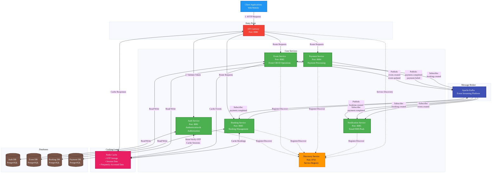

# Event Planner Backend

Java microservices backend for the Event Planner platform.

## Quick Start

```bash
# Build all services
./scripts/build-all.sh

# Run tests
./scripts/test-all.sh
```

## Services

- **user-service**: User management and authentication
- **event-service**: Event creation and management
- **notification-service**: Email and push notifications
- **api-gateway**: API gateway and routing

## Shared Libraries

- **common-lib**: Common utilities and DTOs
- **security-lib**: Authentication and authorization
- **messaging-lib**: Event messaging contracts


## Architecture Diagram

