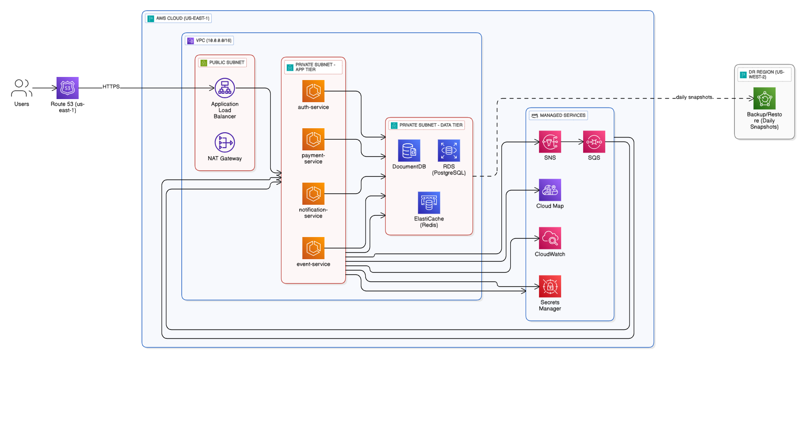

# Event Planner Backend

Java Spring Boot microservices backend for the Event Planner platform.

## Services

- **auth-service** (Port 8081): User authentication and profile management
- **event-service** (Port 8082): Event creation, management, and image uploads
- **notification-service** (Port 8085): Email notifications via SQS/SNS
- **api-gateway** (Port 8080): Request routing and load balancing
- **common-libraries**: Shared utilities, S3Service, DTOs, and exceptions

## Tech Stack

- **Framework**: Spring Boot 3.x
- **Database**: PostgreSQL (RDS)
- **Cache**: Redis (ElastiCache)
- **Messaging**: AWS SQS/SNS
- **Storage**: AWS S3
- **Deployment**: ECS Fargate

## Quick Start

```bash
# Run with Docker Compose
cd services
docker-compose up

# Build individual service
cd services/auth-service
./mvnw clean install
```

## Architecture


