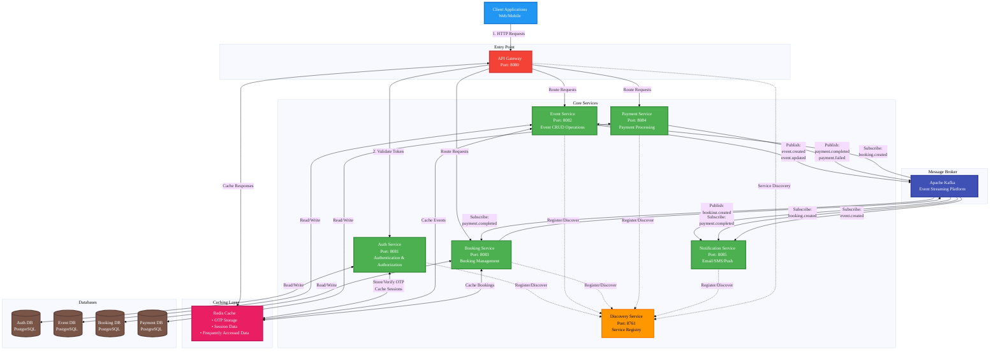

# Event Planner System - Documentation

## Table of Contents
- [Overview](#overview)
- [Features](#features)
    - [Core Features](#core-features)
- [Technology Stack](#technology-stack)
    - [Backend Framework](#backend-framework)
    - [Databases](#databases)
    - [Cloud & Infrastructure](#cloud--infrastructure)
    - [Security](#security)
    - [Additional Technologies](#additional-technologies)
- [Architecture](#architecture)
    - [Microservices Overview](#microservices-overview)
    - [Service Breakdown](#service-breakdown)
    - [AWS Integration](#aws-integration)
- [Getting Started](#getting-started)
    - [Prerequisites](#prerequisites)
    - [Clone the Repository](#clone-the-repository)
    - [Local Development Setup](#local-development-setup)
    - [Running with LocalStack](#running-with-localstack)
    - [Running the Services](#running-the-services)
- [Project Structure](#project-structure)
- [Database Schema & Design](#database-schema--design)
    - [PostgreSQL Schema](#postgresql-schema)
    - [MongoDB Collections](#mongodb-collections)
    - [Entity Relationships](#entity-relationships)
- [Service Documentation](#service-documentation)
    - [Auth Service](#auth-service)
    - [Event Service](#event-service)
    - [Notification Service](#notification-service)
    - [Booking Service](#booking-service)
    - [Payment Service](#payment-service)
- [API Documentation](#api-documentation)
    - [Authentication Endpoints](#authentication-endpoints)
    - [User Management Endpoints](#user-management-endpoints)
- [Security](#security-1)
    - [Authentication Flow](#authentication-flow)
    - [JWT Token Structure](#jwt-token-structure)
    - [Role-Based Access Control](#role-based-access-control)
    - [Password Requirements](#password-requirements)
- [Deployment](#deployment)
    - [AWS Deployment Architecture](#aws-deployment-architecture)
    - [Deployment Steps](#deployment-steps)
- [Contributing](#contributing)
    - [Code Standards](#code-standards)
- [License](#license)
- [Support](#support)

---

## Overview

The Event Planner System is a comprehensive microservices-based platform designed to enable individuals and organizations to create, manage, and register for events efficiently. Built with modern technologies and cloud-native architecture, the system provides a scalable, secure, and highly available solution for event management.

The platform facilitates seamless event planning workflows, from user registration and authentication to event creation, invitation management, ticketing, and payment processing, all while maintaining robust security through JWT-based authentication and role-based access control.

---

## Features

### Core Features

#### 1. User Registration & Authentication (JWT)
- Secure user registration with email validation
- JWT-based authentication for stateless security
- Password encryption and validation (minimum 8 characters, uppercase, numbers, and special characters)
- Session management with Redis caching
- Automatic token expiration and refresh mechanisms

#### 2. User Management
- Comprehensive user profile management
- User search and filtering by role, status, and keywords
- User deactivation and status management
- Admin dashboard with user statistics
- Role-based user categorization (Admin, Organizer, Attendee)
- User activity tracking and analytics

#### 3. Event Creation and Management
- Create and manage events with detailed information
- Event status tracking and lifecycle management
- Event statistics and analytics
- Multi-category event support
- Public and private event options
- Event capacity management

#### 4. Invitations
- Send personalized event invitations
- Track invitation status and responses
- Bulk invitation management
- Unique invitation codes for tracking
- Automated invitation reminders

#### 5. Notifications
- Email notifications for registration, login, and event updates
- Asynchronous message processing via AWS SQS
- Notification templates and customization
- Multi-channel notification support
- Notification history and tracking

#### 6. Role-based Access Control (RBAC)
- Fine-grained permission management
- Resource ownership validation
- Admin, Organizer, and Attendee role hierarchies
- Endpoint-level security with Spring Security
- Custom authorization annotations

#### 7. Event Ticketing
- Ticket creation and management
- Ticket allocation and availability tracking
- Multiple ticket types per event (VIP, Regular, Early Bird)
- Ticket purchase history
- Real-time availability updates

#### 8. Payment Processing
- Secure payment gateway integration
- Transaction tracking and history
- Payment confirmation notifications
- Multiple payment method support
- Refund and cancellation processing

---

## Technology Stack

### Backend Framework
- **Spring Boot 3.5+**: Modern Java framework for building microservices with enhanced performance and features
- **Maven 4.0.0**: Dependency management and build automation
- **Java 21**: Latest LTS version with virtual threads, pattern matching, and enhanced performance

### Databases
- **PostgreSQL 14+**: Primary relational database for structured data (users, events, bookings, payments)
- **MongoDB**: NoSQL database for flexible schema requirements (notifications, logs, analytics)
- **Redis**: In-memory data store for caching, session management, and real-time data

### Cloud & Infrastructure
- **AWS SQS**: Asynchronous message queuing for inter-service communication
- **AWS Load Balancer**: Application load balancing and traffic distribution
- **AWS Cloud Map**: Service discovery and health monitoring
- **LocalStack**: Local AWS cloud stack for development and testing
- **Docker & Docker Compose**: Containerization and orchestration

### Security
- **JWT (JSON Web Tokens)**: Stateless authentication and authorization
- **Spring Security**: Comprehensive security framework with method-level security
- **BCrypt**: Industry-standard password hashing algorithm
- **HTTPS/TLS**: Encrypted communication in production

### Additional Technologies
- **Lombok**: Reduce boilerplate code with annotations
- **Jakarta EE**: Enterprise Java specifications and APIs
- **Spring Data JPA**: Database access and ORM with Hibernate
- **Spring Cloud AWS**: AWS service integration and SDK
- **JavaMail**: Email notification support with SMTP
- **Jackson**: JSON serialization and deserialization
- **Validation API**: Bean validation with Hibernate Validator

---

## Architecture

### Microservices Overview

The Event Planner System follows a microservices architecture pattern, where each service is independently deployable, scalable, and maintainable. This design promotes loose coupling, high cohesion, and allows teams to work on different services simultaneously.

**Key Architectural Principles**:
- **Single Responsibility**: Each service handles a specific business domain
- **Decentralized Data Management**: Each service manages its own database
- **Asynchronous Communication**: Event-driven architecture using message queues
- **API-First Design**: Well-defined RESTful APIs for inter-service communication
- **Resilience**: Circuit breakers, retries, and fallback mechanisms
- **Observability**: Centralized logging, monitoring, and tracing

### Service Breakdown

#### 1. Auth Service
- **Responsibility**: User authentication, authorization, and user management
- **Port**: Configurable (typically 8081)
- **Database**: PostgreSQL
- **Cache**: Redis
- **Key Features**:
    - User registration with comprehensive validation
    - JWT token generation and validation
    - User profile management and updates
    - User statistics and reporting
    - Password encryption and security
    - Role management (Admin, Organizer, Attendee)
- **Dependencies**: Redis for token caching, SQS for event publishing

#### 2. Event Service
- **Responsibility**: Event creation, management, and lifecycle
- **Port**: Configurable (typically 8082)
- **Database**: PostgreSQL/MongoDB (hybrid approach)
- **Key Features**:
    - CRUD operations for events
    - Event categorization and tagging
    - Event search and filtering
    - Event statistics and analytics
    - Attendee management
    - Event capacity tracking
    - Public/private event control
- **Dependencies**: Auth service for user validation

#### 3. Notification Service
- **Responsibility**: Asynchronous notification delivery across multiple channels
- **Port**: Configurable (typically 8083)
- **Database**: MongoDB
- **Message Queue**: AWS SQS
- **Key Features**:
    - Email notifications via SMTP (Gmail)
    - Event-driven notification processing
    - Template-based messaging with customization
    - Notification history and tracking
    - Queue consumers for user registration and login events
    - Retry mechanisms for failed notifications
- **Dependencies**: SQS for message consumption, SMTP for email delivery

#### 4. Booking Service
- **Responsibility**: Event registration and ticket booking
- **Port**: Configurable (typically 8084)
- **Database**: PostgreSQL
- **Key Features**:
    - Ticket reservation and allocation
    - Booking confirmation and validation
    - Booking history and management
    - Cancellation and refund handling
    - Booking code generation
    - Real-time availability checking
- **Dependencies**: Event service, Payment service

#### 5. Payment Service
- **Responsibility**: Payment processing and transaction management
- **Port**: Configurable (typically 8085)
- **Database**: PostgreSQL
- **Key Features**:
    - Payment gateway integration
    - Transaction tracking and history
    - Payment confirmation and receipts
    - Refund processing
    - Multiple payment method support
    - PCI DSS compliance measures
- **Dependencies**: Booking service, Notification service



### AWS Integration

The system leverages AWS managed services to replace traditional Spring Cloud components, providing enhanced reliability, scalability, and reduced operational overhead.

**Service Replacements**:
- **AWS Load Balancer** replaces **Spring Cloud Gateway** for API routing, load balancing, and SSL termination
- **AWS Cloud Map** replaces **Netflix Eureka** for service discovery and health monitoring
- **AWS SQS** provides asynchronous inter-service communication with guaranteed delivery
- **AWS RDS** hosts PostgreSQL databases with automated backups (production)
- **AWS ElastiCache** hosts Redis instances with high availability (production)
- **AWS CloudWatch** for centralized logging and monitoring

**Benefits**:
- Reduced operational overhead with managed services
- Enhanced scalability with auto-scaling capabilities
- Improved reliability with AWS SLA guarantees
- Cost-effective pay-as-you-go model
- Built-in security and compliance features
- Simplified disaster recovery

---

## Getting Started

### Prerequisites

Before running the Event Planner System, ensure you have the following installed:

- **Java 21** (JDK 21+) - [Download here](https://adoptium.net/)
- **Maven 4.0.0+** - [Installation guide](https://maven.apache.org/install.html)
- **PostgreSQL 14+** - [Download here](https://www.postgresql.org/download/)
- **MongoDB 4.4+** - [Download here](https://www.mongodb.com/try/download/community) or use MongoDB Atlas
- **Redis 6+** - [Download here](https://redis.io/download)
- **Docker & Docker Compose** - [Installation guide](https://docs.docker.com/get-docker/)
- **Git** - [Download here](https://git-scm.com/downloads)
- **AWS CLI** (optional, for AWS deployment) - [Installation guide](https://aws.amazon.com/cli/)

### Clone the Repository
```bash
    git clone [https://github.com/your-org/event-planner-system.git](https://github.com/your-org/event-planner-system.git)
    cd services
```

### Local Development Setup

#### 1. Configure Environment Variables

Each service requires environment variables for configuration. Copy the `.env.example` files and create `.env` files:

**Auth Service** (`auth-service/.env`):
```bash
    cd auth-service cp .env.example .env
```

#### 2. Set Up Local Databases

**PostgreSQL**:
```bash
    # Create databases
    createdb auth_db createdb event_db createdb booking_db createdb payment_db
    # Or using psql
    psql -U postgres CREATE DATABASE auth_db; CREATE DATABASE event_db; CREATE DATABASE booking_db; CREATE DATABASE payment_db; \q
```

**MongoDB**:
```bash
    # Start MongoDB (if not running as service)
    mongod
    # Or using Docker
    docker run -d -p 27017:27017 --name mongodb mongo:latest
    # Create database and collections (optional, auto-created)
    mongosh use notification_db db.createCollection("notifications") db.createCollection("email_templates") exit
```

**Redis**:
```bash
    # Start Redis (if not running as service)
    redis-server
    # Or using Docker
    docker run -d -p 6379:6379 --name redis redis:latest
    # Test Redis connection
    redis-cli ping
    # Should return: PONG
```

### Running with LocalStack

LocalStack allows you to emulate AWS services locally for development and testing without incurring AWS costs.

#### 1. Start LocalStack
```bash
    # Navigate to project root
    cd event-planner-system
    # Start LocalStack using Docker Compose
    docker-compose up -d
    # Verify LocalStack is running
    docker ps | grep localstack
    # Check LocalStack health
    curl [http://localhost:4566/_localstack/health](http://localhost:4566/_localstack/health)
```
The `docker-compose.yml` file contains:

```yaml
    services: 
      localstack:
        image: localstack/localstack:latest 
        container_name: localstack 
        ports: 
          - "4566:4566" # LocalStack Gateway 
          - "8080:8080" # LocalStack Dashboard 
        environment:
          - SERVICES=sqs # Enable SQS service 
          - DEBUG=1 # Enable debug logging 
          - DATA_DIR=/var/lib/localstack 
          - DEFAULT_REGION=us-east-1 
        volumes: 
          - "./localstack_data:/var/lib/localstack" 
          - "/var/run/docker.sock:/var/run/docker.sock"

```

#### 2. Create SQS Queues in LocalStack
```bash
    # Install awslocal (wrapper for AWS CLI with LocalStack)
    pip install awscli-local
    # Create user registration queue
    awslocal sqs create-queue
    --queue-name user-registration-queue
    --region us-east-1
    # Create user login queue
    awslocal sqs create-queue
    --queue-name user-login-queue
    --region us-east-1
    # Verify queues were created
    awslocal sqs list-queues --region us-east-1
    # Get queue URLs (useful for configuration)
    awslocal sqs get-queue-url
    --queue-name user-registration-queue
    --region us-east-1
```

#### 3. Update Service Configuration

Ensure your `application-local.properties` or `.env` files point to LocalStack:
```properties
    # LocalStack SQS endpoint
    spring.cloud.aws.sqs.endpoint=http://localhost:4566](http://localhost:4566
    spring.cloud.aws.region.static=us-east-1
    spring.cloud.aws.credentials.access-key=test
    spring.cloud.aws.credentials.secret-key=test
```

### Running the Services

#### Option 1: Run Services Individually (Development)

**Terminal 1 - Auth Service**:
```bash
    cd auth-service 
    mvn clean install 
    mvn spring-boot:run -Dspring.profiles.active=dev
```

**Terminal 2 - Notification Service**:
```bash
    cd notification-service 
    mvn clean install 
    mvn spring-boot:run -Dspring.profiles.active=dev
```
**Terminal 3 - Event Service**:
```bash
    cd event-service
    mvn clean install
    mvn spring-boot:run -Dspring.profiles.active=dev
```
**Terminal 4 - Booking Service**:
```bash
    cd booking-service
    mvn clean install
    mvn spring-boot:run -Dspring.profiles.active=dev
```

**Terminal 5 - Payment Service**:
```bash
    cd payment-service
    mvn clean install
    mvn spring-boot:run -Dspring.profiles.active=local
```

#### Option 2: Build and Run with Maven
```bash
# Build all services from root
mvn clean install

# Run each service
cd auth-service
java -jar target/auth-service-1.0.0.jar --spring.profiles.active=dev

# In separate terminals for other services
cd event-service
java -jar target/event-service-1.0.0.jar --spring.profiles.active=dev
```

#### Option 3: Docker Compose (All Services)
Create a `docker-compose-services.yml` file to run all services together:
```yaml
version: '3.8'

services:
  # Infrastructure Services
  postgres:
    image: postgres:14
    container_name: postgres
    environment:
      POSTGRES_USER: postgres
      POSTGRES_PASSWORD: password
      POSTGRES_MULTIPLE_DATABASES: auth_db,event_db,booking_db,payment_db
    ports:
      - "5432:5432"
    volumes:
      - postgres_data:/var/lib/postgresql/data
    healthcheck:
      test: ["CMD-SHELL", "pg_isready -U postgres"]
      interval: 10s
      timeout: 5s
      retries: 5

  mongodb:
    image: mongo:latest
    container_name: mongodb
    ports:
      - "27017:27017"
    volumes:
      - mongo_data:/data/db
    healthcheck:
      test: ["CMD", "mongosh", "--eval", "db.adminCommand('ping')"]
      interval: 10s
      timeout: 5s
      retries: 5

  redis:
    image: redis:latest
    container_name: redis
    ports:
      - "6379:6379"
    healthcheck:
      test: ["CMD", "redis-cli", "ping"]
      interval: 10s
      timeout: 5s
      retries: 5

  localstack:
    image: localstack/localstack:latest
    container_name: localstack
    ports:
      - "4566:4566"
      - "8080:8080"
    environment:
      - SERVICES=sqs
      - DEFAULT_REGION=us-east-1
      - DEBUG=1
    volumes:
      - "./localstack_data:/var/lib/localstack"

  # Application Services
  auth-service:
    build: ./auth-service
    container_name: auth-service
    ports:
      - "8081:8081"
    environment:
      SPRING_PROFILES_ACTIVE: dev
      DB_HOST: postgres
      REDIS_HOST: redis
      SQS_ENDPOINT: http://localstack:4566
    depends_on:
      postgres:
        condition: service_healthy
      redis:
        condition: service_healthy
      localstack:
        condition: service_started

  event-service:
    build: ./event-service
    container_name: event-service
    ports:
      - "8082:8082"
    environment:
      SPRING_PROFILES_ACTIVE: dev
      DB_HOST: postgres
    depends_on:
      postgres:
        condition: service_healthy

  notification-service:
    build: ./notification-service
    container_name: notification-service
    ports:
      - "8083:8083"
    environment:
      SPRING_PROFILES_ACTIVE: dev
      MONGO_HOST: mongodb
      SQS_ENDPOINT: http://localstack:4566
    depends_on:
      mongodb:
        condition: service_healthy
      localstack:
        condition: service_started

  booking-service:
    build: ./booking-service
    container_name: booking-service
    ports:
      - "8084:8084"
    environment:
      SPRING_PROFILES_ACTIVE: dev
      DB_HOST: postgres
    depends_on:
      postgres:
        condition: service_healthy

  payment-service:
    build: ./payment-service
    container_name: payment-service
    ports:
      - "8085:8085"
    environment:
      SPRING_PROFILES_ACTIVE: dev
      DB_HOST: postgres
    depends_on:
      postgres:
        condition: service_healthy

volumes:
  postgres_data:
  mongo_data:
```

#### Run all services:
```bash
# Start all services
docker-compose -f docker-compose-services.yml up -d

# View logs
docker-compose -f docker-compose-services.yml logs -f

# Stop all services
docker-compose -f docker-compose-services.yml down

# Stop and remove volumes
docker-compose -f docker-compose-services.yml down -v
```

#### Verify Services are Running
Check service health endpoints:
```bash
# Auth Service
curl http://localhost:8081/actuator/health

# Event Service
curl http://localhost:8082/actuator/health

# Notification Service
curl http://localhost:8083/actuator/health

# Booking Service
curl http://localhost:8084/actuator/health

# Payment Service
curl http://localhost:8085/actuator/health
```

#### Expected response:
``` json
{
  "status": "UP"
}
```

## Project Structure
```event-planner-system/
├── auth-service/
│   ├── src/
│   │   ├── main/
│   │   │   ├── java/com/example/auth_service/
│   │   │   │   ├── controller/
│   │   │   │   ├── service/
│   │   │   │   ├── repository/
│   │   │   │   ├── model/
│   │   │   │   ├── dto/
│   │   │   │   │   ├── request/
│   │   │   │   │   └── response/
│   │   │   │   ├── security/
│   │   │   │   ├── event/
│   │   │   │   ├── config/
│   │   │   │   ├── exception/
│   │   │   │   ├── mapper/
│   │   │   │   ├── enums/
│   │   │   │   └── utils/
│   │   │   ├── resources/
│   │   │   │   └── db/migration/
│   │   │   └── webapp/
│   │   └── test/
│   │       ├── java/com/example/auth_service/
│   │       │   ├── controller/
│   │       │   ├── service/
│   │       │   └── integration/
│   │       └── resources/
│   └── (pom.xml, Dockerfile, etc.)
│
├── event-service/
│   ├── src/
│   │   ├── main/
│   │   │   ├── java/com/example/event_service/
│   │   │   │   ├── controller/
│   │   │   │   ├── service/
│   │   │   │   ├── repository/
│   │   │   │   ├── model/
│   │   │   │   ├── dto/
│   │   │   │   ├── config/
│   │   │   │   └── exception/
│   │   │   └── resources/
│   │   └── test/
│   └── (pom.xml, Dockerfile, etc.)
│
├── notification-service/
│   ├── src/
│   │   ├── main/
│   │   │   ├── java/com/example/notification_service/
│   │   │   │   ├── controller/
│   │   │   │   ├── service/
│   │   │   │   ├── repository/
│   │   │   │   ├── model/
│   │   │   │   ├── event/
│   │   │   │   ├── config/
│   │   │   │   ├── dto/
│   │   │   │   └── templates/
│   │   │   └── resources/
│   │   └── test/
│   └── (pom.xml, Dockerfile, etc.)
│
├── booking-service/
│   ├── src/
│   │   ├── main/
│   │   │   ├── java/com/example/booking_service/
│   │   │   │   ├── controller/
│   │   │   │   ├── service/
│   │   │   │   ├── repository/
│   │   │   │   ├── model/
│   │   │   │   ├── dto/
│   │   │   │   ├── config/
│   │   │   │   └── exception/
│   │   │   └── resources/
│   │   └── test/
│   └── (pom.xml, Dockerfile, etc.)
│
├── payment-service/
│   ├── src/
│   │   ├── main/
│   │   │   ├── java/com/example/payment_service/
│   │   │   │   ├── controller/
│   │   │   │   ├── service/
│   │   │   │   ├── repository/
│   │   │   │   ├── model/
│   │   │   │   ├── dto/
│   │   │   │   ├── config/
│   │   │   │   └── exception/
│   │   │   └── resources/
│   │   └── test/
│   └── (pom.xml, Dockerfile, etc.)
│
├── api-gateway/
│   ├── src/
│   └── (pom.xml, Dockerfile)
│
├── discovery-server/
│   ├── src/
│   └── (pom.xml, Dockerfile)
│
├── config-server/
│   ├── src/
│   └── (pom.xml, Dockerfile)
│
├── docker-compose.yml
├── docker-compose-services.yml
├── pom.xml
├── .gitignore
├── LICENSE
└── README.md

```


## Database Schema & Design
### PostgreSQL Schema
The PostgreSQL database stores structured, relational data for users, events, bookings, and payments. The schema is designed with normalization principles and optimized for query performance.


## Service Documentation
### Auth Service
**Responsibility**: User authentication, authorization, and user management
**Base URL**: `http://localhost:8081/api/v1`
**Key Endpoints**:

| Method | Endpoint | Description | Auth Required |
| --- | --- | --- | --- |
| POST | `/auth/register` | Register new user | No |
| POST | `/auth/login` | User login (returns JWT) | No |
| POST | `/auth/logout` | User logout | Yes |
| POST | `/auth/refresh-token` | Refresh JWT token | Yes |
| GET | `/users/management` | Get user summary report | Yes (Admin) |
| GET | `/users/search` | Search users | Yes (Admin) |
| GET | `/users/{userId}` | Get user by ID | Yes (Admin/Owner) |
| PUT | `/users/{userId}` | Update user | Yes (Admin/Owner) |
| POST | `/users/{userId}/deactivate` | Deactivate user | Yes (Admin/Owner) |
| GET | `/users/{userId}/profile` | Get user profile | Yes (Admin/Owner) |
| PUT | `/users/{userId}/profile` | Update user profile | Yes (Admin/Owner) |
**User Registration Validation Rules**:
- **Full Name**:
    - Required
    - Must start and end with a letter
    - Can contain only letters, spaces, hyphens, or apostrophes
    - Pattern: `^[A-Za-z]+([ '-][A-Za-z]+)*$`

- **Email**:
    - Required
    - Valid email format
    - Must be unique in the system

- **Password**:
    - Required
    - Minimum 8 characters
    - Must contain at least one uppercase letter
    - Must contain at least one number
    - Must contain at least one special character
    - Pattern: `^(?=.*[A-Z])(?=.*[0-9])(?=.*[!@#$%^&*()_+\-=\[\]{};':"\\|,.<>/?]).*$`

- **Confirm Password**:
    - Required
    - Must match the password field

**Security Features**:
- JWT token expiration: Configurable (default 24 hours)
- Password encryption: BCrypt with 10 rounds
- Role-based access control via `@PreAuthorize`
- Resource ownership validation via custom `@resourceOwner` component
- Redis-based token caching for performance
- Automatic token refresh mechanism

**Events Published**:
- → SQS (user-registration-queue)
    - Triggers welcome email notification

`UserRegisteredEvent`
- → SQS (user-login-queue)
    - Triggers login notification email

`UserLoginEvent`

**User Roles**:
- **ADMIN**: Full system access, user management, system configuration
- **ORGANIZER**: Create/manage events, view attendees, manage invitations
- **ATTENDEE**: Browse events, register for events, manage bookings (default role)


### Notification Service
**Responsibility**: Asynchronous notification delivery across multiple channels
**Base URL**: `http://localhost:8083/api/v1`
**Key Features**:
- Email notifications via Gmail SMTP
- Event-driven architecture with SQS consumers
- Template-based emails with variable substitution
- Notification history and tracking
- Retry mechanism for failed notifications
- Support for HTML and plain text emails

**SQS Message Consumers**:
1. **User Registration Queue** (`user-registration-queue`)
    - Listens for `UserRegisteredEvent`
    - Sends welcome email with account details
    - Includes getting started guide

2. **User Login Queue** (`user-login-queue`)
    - Listens for `UserLoginEvent`
    - Sends login notification with timestamp and location
    - Security alert feature

**Email Configuration**:
- **SMTP Host**: smtp.gmail.com
- **Port**: 465 (SSL/TLS)
- **Authentication**: Required
- **Protocols**: TLSv1.2
- **Connection Pool**: Enabled for performance


## Security
### Authentication Flow
``` 
┌─────────┐                ┌──────────────┐                ┌──────────┐
│ Client  │                │ Auth Service │                │  Redis   │
└────┬────┘                └──────┬───────┘                └────┬─────┘
     │                            │                              │
     │  1. POST /auth/register    │                              │
     ├───────────────────────────>│                              │
     │                            │                              │
     │                            │  2. Validate input           │
     │                            │     Hash password            │
     │                            │     Save to database         │
     │                            │                              │
     │  3. 201 Created            │                              │
     │<───────────────────────────┤                              │
     │                            │                              │
     │  4. POST /auth/login       │                              │
     ├───────────────────────────>│                              │
     │                            │                              │
     │                            │  5. Validate credentials     │
     │                            │     Generate JWT token       │
     │                            │                              │
     │                            │  6. Cache token              │
     │                            ├─────────────────────────────>│
     │                            │                              │
     │  7. 200 OK (JWT token)     │                              │
     │<───────────────────────────┤                              │
     │                            │                              │
     │  8. GET /api/resource      │                              │
     │    Authorization: Bearer.. │                              │
     ├───────────────────────────>│                              │
     │                            │                              │
     │                            │  9. Check token cache        │
     │                            ├─────────────────────────────>│
     │                            │                              │
     │                            │  10. Token valid             │
     │                            │<─────────────────────────────┤
     │                            │                              │
     │                            │  11. Extract user claims     │
     │                            │      Verify permissions      │
     │                            │                              │
     │  12. 200 OK (Resource)     │                              │
     │<───────────────────────────┤                              │
     │                            │                              │
```
**Step-by-Step Process**:
1. User submits registration form with credentials
2. Auth service validates input and hashes password
3. User record created in database
4. User logs in with email and password
5. Auth service validates credentials
6. JWT token generated with user claims (id, email, role)
7. Token cached in Redis for fast validation
8. Client receives token and stores it (localStorage/sessionStorage)
9. Client includes token in Authorization header for subsequent requests
10. Services validate token (check signature and expiration)
11. User information extracted from token claims
12. Request processed based on user permissions


### Role-Based Access Control
**Role Hierarchy**:
``` 
ADMIN (highest)
  ├─ Can manage all users
  ├─ Can view all events
  ├─ Can manage system configuration
  ├─ Can access all endpoints
  └─ Can perform all operations

ORGANIZER (middle)
  ├─ Can create and manage own events
  ├─ Can view event attendees
  ├─ Can send invitations
  ├─ Can manage event tickets
  └─ Can view event analytics

ATTENDEE (lowest)
  ├─ Can browse public events
  ├─ Can register for events
  ├─ Can manage own bookings
  ├─ Can update own profile
  └─ Can view own event history
```


## Deployment
### AWS Deployment Architecture
``` 
                             ┌─────────────────────┐
                             │   AWS Route 53      │
                             │   (DNS)             │
                             └──────────┬──────────┘
                                        │
                             ┌──────────▼──────────┐
                             │ Application Load    │
                             │ Balancer (ALB)      │
                             │ - SSL/TLS           │
                             │ - Health Checks     │
                             └──────────┬──────────┘
                                        │
        ┌───────────────────────────────┼───────────────────────────────┐
        │                               │                               │
        │                               │                               │
┌───────▼────────┐           ┌──────────▼──────────┐        ┌──────────▼─────────┐
│ Target Group 1 │           │  Target Group 2     │        │  Target Group 3    │
│ (Auth Service) │           │  (Event Service)    │        │ (Notification Svc) │
└───────┬────────┘           └──────────┬──────────┘        └──────────┬─────────┘
        │                               │                               │
        │                               │                               │
┌───────▼────────┐           ┌──────────▼──────────┐        ┌──────────▼─────────┐
│  ECS/Fargate   │           │    ECS/Fargate      │        │   ECS/Fargate      │
│  Auth Service  │           │   Event Service     │        │ Notification Svc   │
│  (Containers)  │           │   (Containers)      │        │  (Containers)      │
└───────┬────────┘           └──────────┬──────────┘        └──────────┬─────────┘
        │                               │                               │
        │                               │                               │
        └───────────────────────────────┼───────────────────────────────┘
                                        │
        ┌───────────────────────────────┼───────────────────────────────┐
        │                               │                               │
        │                               │                               │
┌───────▼────────┐           ┌──────────▼──────────┐        ┌──────────▼─────────┐
│   AWS RDS      │           │     AWS SQS         │        │  AWS ElastiCache   │
│ (PostgreSQL)   │           │   - user-reg-queue  │        │     (Redis)        │
│ - Multi-AZ     │           │   - user-login-queue│        │   - Session Cache  │
│ - Auto Backup  │           │   - event-queue     │        │   - Token Cache    │
└────────────────┘           └─────────────────────┘        └────────────────────┘
        │
        │
┌───────▼────────┐           ┌─────────────────────┐        ┌────────────────────┐
│   AWS S3       │           │  AWS CloudWatch     │        │  AWS Cloud Map     │
│ - Static Files │           │  - Logs             │        │  - Service         │
│ - Backups      │           │  - Metrics          │        │    Discovery       │
└────────────────┘           │  - Alarms           │        │  - Health Checks   │
                             └─────────────────────┘        └────────────────────┘
```
**Architecture Components**:
1. **Route 53**: DNS management and routing
2. **Application Load Balancer**:
    - Distributes traffic across services
    - SSL/TLS termination
    - Path-based routing
    - Health checks

3. **ECS/Fargate**: Containerized service hosting
    - Auto-scaling based on CPU/Memory
    - Service mesh integration
    - Blue/green deployments

4. **RDS PostgreSQL**: Managed relational database
    - Multi-AZ deployment for HA
    - Automated backups
    - Read replicas for scaling

5. **ElastiCache Redis**: Managed Redis cluster
    - Cluster mode enabled
    - Automatic failover
    - In-memory caching

6. **SQS**: Message queuing
    - Dead letter queues
    - Message retention
    - FIFO queues for ordering

7. **CloudWatch**: Monitoring and logging
    - Centralized logs
    - Custom metrics
    - Alarms and notifications

8. **Cloud Map**: Service discovery
    - DNS-based discovery
    - Health checking
    - API-based registration


