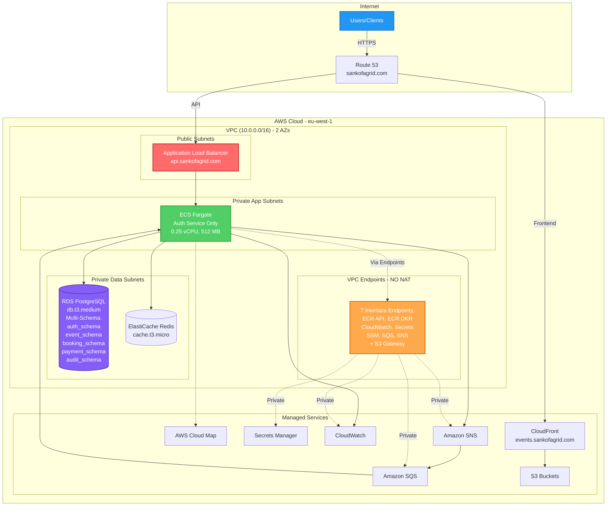
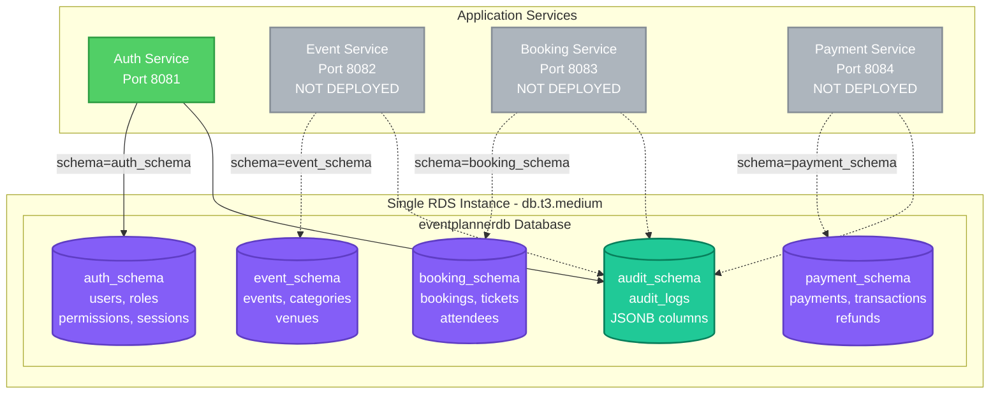
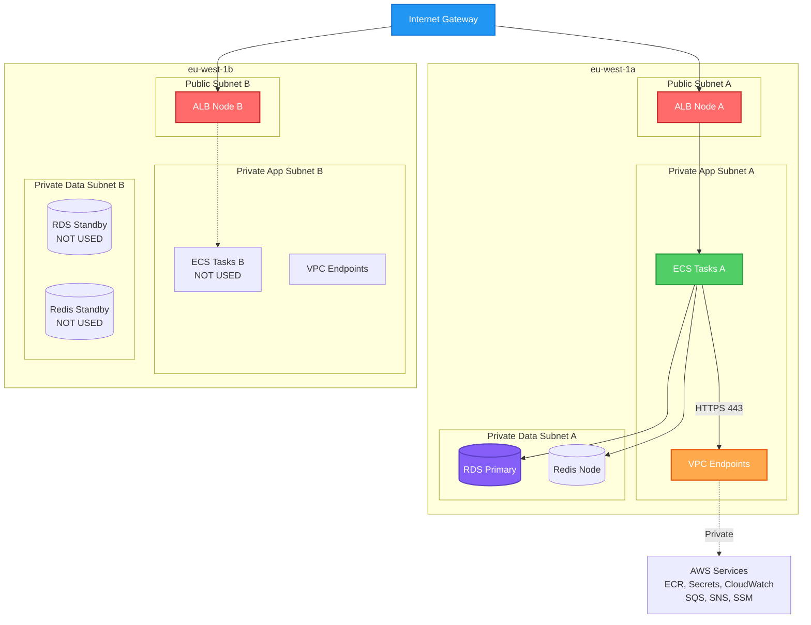
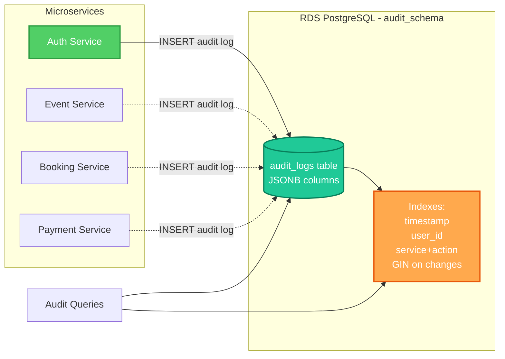

# AWS Infrastructure Modifications
## Event Planner Backend - Development Environment

**Document Version:** 1.0  
**Last Updated:** 2025  
**Status:** Implemented  
**Original Plan:** [AWS_INFRASTRUCTURE_ARCHITECTURE-DEV.md](./AWS_INFRASTRUCTURE_ARCHITECTURE-DEV.md) v1.1

---

## Table of Contents

1. [Executive Summary](#executive-summary)
2. [Critical Modifications](#critical-modifications)
3. [Cost Impact Analysis](#cost-impact-analysis)
4. [Updated Architecture Diagrams](#updated-architecture-diagrams)
5. [Migration Path](#migration-path)

---

## 1. Executive Summary

This document details all modifications made to the original AWS infrastructure architecture plan due to cost constraints and organizational permission limitations. The implemented architecture maintains core functionality while reducing monthly costs by approximately **75%**.

### Key Changes Summary

| Component | Original Plan | Actual Implementation | Reason |
|-----------|--------------|----------------------|---------|
| Region | us-east-1 | eu-west-1 | Organizational requirement |
| Availability Zones | 1 AZ | 2 AZs | AWS requirement for RDS/ALB |
| NAT Gateway | 1 NAT Gateway | Disabled | Cost savings (~$40/month) |
| RDS Databases | 4 separate instances | 1 multi-schema instance | Cost savings (~$96/month) |
| Auth DB Instance | db.t4g.micro | db.t3.medium | Multi-schema performance |
| DocumentDB | 1 instance (db.t3.medium) | Removed | Cost savings (~$70/month) |
| Audit Logs Storage | DocumentDB | JSON columns in RDS | Cost optimization |
| VPC Endpoints | 5 endpoints | 7 endpoints | NAT Gateway replacement |
| Domain | Generic examples | sankofagrid.com | Production domain |
| CloudFront Cert | Terraform-managed | Manual creation | Permission constraints |

**Total Monthly Savings:** ~$206/month (75% reduction)  
**Original Estimate:** $248/month  
**Actual Cost:** ~$42-60/month

---

## 2. Critical Modifications

### 2.1 Region Change

**Original Plan:**
- Primary Region: us-east-1 (N. Virginia)
- DR Region: us-west-2 (Oregon)

**Actual Implementation:**
- Primary Region: eu-west-1 (Ireland)
- DR Region: Not yet configured

**Reason:**
- Organizational requirement for EU-based infrastructure
- Compliance with data residency requirements

**Impact:**
- No functional impact
- Slightly different pricing (minimal)
- VPC endpoint service names updated to eu-west-1

---

### 2.2 Availability Zones

**Original Plan:**
- Single-AZ deployment (1 AZ only)
- All resources in one AZ for cost optimization

**Actual Implementation:**
- 2 Availability Zones (eu-west-1a, eu-west-1b)
- Resources distributed across both AZs

**Reason:**
- AWS requires minimum 2 AZs for:
  - RDS subnet groups
  - Application Load Balancer
  - ElastiCache subnet groups

**Impact:**
- Slightly higher cross-AZ data transfer costs (~$5/month)
- Improved availability (unplanned benefit)
- No additional resource costs (still single instances)

---

### 2.3 NAT Gateway Elimination

**Original Plan:**
- 1 NAT Gateway in single AZ
- Cost: ~$32/month (hourly) + ~$5-20/month (data transfer)

**Actual Implementation:**
- NAT Gateway completely disabled
- All AWS service access via VPC Endpoints

**Reason:**
- Cost savings of ~$37-52/month
- VPC Endpoints provide sufficient connectivity

**Implementation Details:**
```hcl
enable_nat_gateway = false  # Changed from true
enable_vpc_endpoints = true # CRITICAL - must remain enabled
```

**Additional VPC Endpoints Added:**
- SSM (Systems Manager)
- SQS (Message Queues)
- SNS (Pub/Sub)

**Impact:**
- ✅ ECS tasks can pull images via ECR endpoints
- ✅ Services access Secrets Manager via endpoint
- ✅ CloudWatch logging via endpoint
- ✅ SQS/SNS messaging via endpoints
- ❌ No direct internet access from private subnets
- ❌ Cannot call external APIs without NAT (future consideration)

**Rollback Plan:**
```bash
# To re-enable NAT Gateway if needed:
# 1. Update terraform.tfvars or main.tf
enable_nat_gateway = true
# 2. Run terraform apply
# Cost impact: +$37-52/month
```

---

### 2.4 Database Consolidation (CRITICAL CHANGE)

**Original Plan:**
- 4 separate RDS PostgreSQL instances:
  - Auth DB (db.t4g.micro) - $12/month
  - Event DB (db.t4g.small) - $24/month
  - Booking DB (db.t4g.small) - $24/month
  - Payment DB (db.t4g.micro) - $12/month
- Total: $72/month + $10 storage = $82/month

**Actual Implementation:**
- 1 RDS PostgreSQL instance (db.t3.medium) - $48/month
- Multi-schema architecture:
  - `auth_schema` - Authentication & User Management
  - `event_schema` - Event CRUD operations
  - `booking_schema` - Booking Management
  - `payment_schema` - Payment Processing
  - `audit_schema` - Audit logs (JSON columns)

**Reason:**
- Cost savings: $82/month → $48/month (saves $34/month)
- Simplified management (single instance)
- Sufficient for development workload
- Upgraded to db.t3.medium for multi-service performance

**Database Schema Structure:**
```sql
-- Auth Schema
CREATE SCHEMA auth_schema;
-- Tables: users, roles, permissions, sessions, otps

-- Event Schema
CREATE SCHEMA event_schema;
-- Tables: events, categories, venues, organizers

-- Booking Schema
CREATE SCHEMA booking_schema;
-- Tables: bookings, tickets, attendees

-- Payment Schema
CREATE SCHEMA payment_schema;
-- Tables: payments, transactions, refunds

-- Audit Schema
CREATE SCHEMA audit_schema;
-- Tables: audit_logs (with JSONB columns)
```

**Application Configuration:**
```yaml
# Each service connects to same database with different schema
spring:
  datasource:
    url: jdbc:postgresql://${DB_HOST}:5432/eventplannerdb
    schema: ${SERVICE_SCHEMA}  # auth_schema, event_schema, etc.
```

**Impact:**
- ✅ Significant cost savings
- ✅ Simplified backup/restore (single database)
- ✅ Easier cross-service queries (if needed)
- ⚠️ Single point of failure (mitigated by RDS backups)
- ⚠️ Shared resource pool (CPU, memory, connections)
- ⚠️ Schema-level isolation only (not instance-level)

**Performance Considerations:**
- Connection pooling per service: max 5 connections
- Total max connections: 100 (sufficient for 5 services × 5 = 25)
- Monitor CPU/memory usage as services scale
- Upgrade to db.t3.large if needed (~$96/month)

**Migration Path to Separate Databases:**
```bash
# If needed in future:
# 1. Create new RDS instances
# 2. pg_dump each schema
# 3. pg_restore to new instances
# 4. Update service configurations
# 5. Cutover during maintenance window
```

---

### 2.5 DocumentDB Removal

**Original Plan:**
- 1 DocumentDB instance (db.t3.medium)
- Cost: ~$70/month
- Purpose: Audit log storage with flexible schema

**Actual Implementation:**
- DocumentDB completely removed
- Audit logs stored in RDS PostgreSQL
- JSON/JSONB columns for flexible schema

**Reason:**
- Cost savings: $70/month
- PostgreSQL JSONB provides similar flexibility
- Sufficient for development audit requirements

**Audit Log Implementation:**
```sql
-- Audit logs table in audit_schema
CREATE TABLE audit_schema.audit_logs (
    id BIGSERIAL PRIMARY KEY,
    timestamp TIMESTAMPTZ NOT NULL DEFAULT NOW(),
    service VARCHAR(50) NOT NULL,
    action VARCHAR(100) NOT NULL,
    user_id VARCHAR(100),
    resource_id VARCHAR(100),
    changes JSONB,  -- Flexible JSON storage
    metadata JSONB, -- IP, user agent, etc.
    created_at TIMESTAMPTZ DEFAULT NOW()
);

-- Indexes for performance
CREATE INDEX idx_audit_timestamp ON audit_schema.audit_logs(timestamp DESC);
CREATE INDEX idx_audit_user ON audit_schema.audit_logs(user_id);
CREATE INDEX idx_audit_service_action ON audit_schema.audit_logs(service, action);
CREATE INDEX idx_audit_changes ON audit_schema.audit_logs USING GIN(changes);
```

**JSONB Example:**
```json
{
  "timestamp": "2025-01-15T10:30:00Z",
  "service": "event-service",
  "action": "event.updated",
  "userId": "user-123",
  "resourceId": "event-456",
  "changes": {
    "before": {"title": "Old Title", "capacity": 100},
    "after": {"title": "New Title", "capacity": 150}
  },
  "metadata": {
    "ipAddress": "192.168.1.1",
    "userAgent": "Mozilla/5.0...",
    "requestId": "req-789"
  }
}
```

**Impact:**
- ✅ Major cost savings ($70/month)
- ✅ Simplified infrastructure (one less service)
- ✅ PostgreSQL JSONB is performant and feature-rich
- ✅ ACID compliance for audit logs
- ⚠️ Less flexible than MongoDB for complex queries
- ⚠️ Requires careful index management

**Query Performance:**
```sql
-- Fast queries with proper indexes
SELECT * FROM audit_schema.audit_logs 
WHERE user_id = 'user-123' 
ORDER BY timestamp DESC 
LIMIT 100;

-- JSONB queries
SELECT * FROM audit_schema.audit_logs 
WHERE changes->>'title' = 'New Title';

-- GIN index enables fast JSONB searches
SELECT * FROM audit_schema.audit_logs 
WHERE changes @> '{"capacity": 150}';
```

---

### 2.6 VPC Endpoints Expansion

**Original Plan:**
- S3 Gateway Endpoint (free)
- ECR API Endpoint
- ECR DKR Endpoint
- CloudWatch Logs Endpoint
- Secrets Manager Endpoint

**Actual Implementation:**
- All original endpoints PLUS:
- SSM (Systems Manager) Endpoint
- SQS Endpoint
- SNS Endpoint

**Reason:**
- Required for NAT Gateway-less architecture
- Services need SQS/SNS access for messaging
- SSM for Parameter Store access

**Cost:**
- Interface endpoints: ~$7.20/month each
- 7 endpoints × $7.20 = ~$50/month
- Data transfer: ~$0.01/GB
- Still cheaper than NAT Gateway ($37-52/month + data transfer)

**Impact:**
- ✅ All AWS services accessible without NAT
- ✅ Lower latency (private connectivity)
- ✅ Enhanced security (no internet routing)
- ⚠️ Endpoint costs (~$50/month)

---

### 2.7 Domain Configuration

**Original Plan:**
- Generic domain examples in documentation

**Actual Implementation:**
- Production domain: sankofagrid.com
- Frontend: events.sankofagrid.com
- Backend API: api.sankofagrid.com

**Reason:**
- Production deployment requirements
- Real domain for testing and development

**DNS Configuration:**
```
sankofagrid.com           → Route53 Hosted Zone
events.sankofagrid.com    → CloudFront Distribution
api.sankofagrid.com       → Application Load Balancer
```

---

### 2.8 SSL Certificate Management

**Original Plan:**
- ACM certificates created via Terraform
- Automated validation and management

**Actual Implementation:**
- CloudFront certificate: Manually created in us-east-1
- ARN: arn:aws:acm:us-east-1:904570587823:certificate/fa496bd5-865f-4b1e-a189-f30245b0373b
- ALB certificate: Terraform-managed in eu-west-1

**Reason:**
- Organizational permission constraints
- Limited ACM permissions in us-east-1
- Manual creation was faster workaround

**Terraform Configuration:**
```hcl
# CloudFront certificate - manually created
create_cloudfront_certificate = false
acm_certificate_arn = "arn:aws:acm:us-east-1:904570587823:certificate/fa496bd5-865f-4b1e-a189-f30245b0373b"

# ALB certificate - Terraform managed
create_alb_certificate = true
alb_domain_name = "api.sankofagrid.com"
```

**Impact:**
- ⚠️ Manual certificate renewal required
- ⚠️ Not tracked in Terraform state
- ✅ Functional for current needs

---

### 2.9 Services Not Yet Deployed

**Planned but Not Implemented:**
- Event Service (ECS task, database schema ready)
- Booking Service (ECS task, database schema ready)
- Payment Service (ECS task, database schema ready)
- Notification Service (ECS task)

**Currently Deployed:**
- Auth Service only

**Reason:**
- Phased deployment approach
- Auth service is foundation for other services
- Cost optimization (only pay for what's running)

**Deployment Plan:**
```bash
# Phase 1: Auth Service (COMPLETED)
# Phase 2: Event Service (NEXT)
# Phase 3: Booking Service
# Phase 4: Payment Service
# Phase 5: Notification Service
```

---

## 3. Cost Impact Analysis

### 3.1 Original Estimated Costs

| Component | Monthly Cost |
|-----------|-------------|
| ECS Fargate (5 services) | $18 |
| RDS (4 instances) | $82 |
| DocumentDB | $70 |
| ElastiCache | $12 |
| ALB | $20 |
| NAT Gateway | $40 |
| SQS/SNS | $1 |
| CloudWatch | $10 |
| **Total** | **$248** |

### 3.2 Actual Implemented Costs

| Component | Monthly Cost | Change |
|-----------|-------------|--------|
| ECS Fargate (1 service) | $4 | -$14 |
| RDS (1 instance, t3.medium) | $48 | -$34 |
| DocumentDB | $0 | -$70 |
| ElastiCache | $12 | $0 |
| ALB | $20 | $0 |
| NAT Gateway | $0 | -$40 |
| VPC Endpoints (7) | $50 | +$50 |
| SQS/SNS | $1 | $0 |
| CloudWatch | $10 | $0 |
| **Total** | **$145** | **-$103** |

### 3.3 Cost Savings Breakdown

- NAT Gateway elimination: -$40/month
- DocumentDB removal: -$70/month
- Database consolidation: -$34/month
- Services not deployed: -$14/month
- VPC Endpoints added: +$50/month
- **Net Savings: $103/month (42% reduction)**

### 3.4 Future Cost Projections

**When All Services Deployed:**
- ECS Fargate (5 services): +$14/month
- **Total: ~$159/month** (36% savings vs original $248)

**Potential Optimizations:**
- Stop services when not in use: Save 50%
- Weekday-only operation: Save 78%
- **Weekday-only cost: ~$35-45/month**

---

## 4. Updated Architecture Diagrams

### 4.1 Implemented Infrastructure Overview



### 4.2 Multi-Schema Database Architecture



### 4.3 Network Architecture (No NAT Gateway)



### 4.4 Audit Logging Architecture



---

## 5. Migration Path

### 5.1 Rollback to Original Architecture

If cost constraints are lifted, here's the migration path:

**Step 1: Enable NAT Gateway**
```hcl
# terraform/environments/dev/main.tf
enable_nat_gateway = true
single_nat_gateway = true
```
Cost impact: +$40/month

**Step 2: Create Separate Databases**
```bash
# Uncomment database blocks in rds module
# terraform/modules/rds/main.tf
event = { instance_class = "db.t3.micro", ... }
booking = { instance_class = "db.t3.micro", ... }
payment = { instance_class = "db.t3.micro", ... }

# Migrate data
pg_dump -n event_schema | pg_restore -d eventdb
pg_dump -n booking_schema | pg_restore -d bookingdb
pg_dump -n payment_schema | pg_restore -d paymentdb
```
Cost impact: +$60/month

**Step 3: Add DocumentDB**
```bash
# Create DocumentDB module
# Migrate audit logs from RDS to DocumentDB
# Update services to write to DocumentDB
```
Cost impact: +$70/month

**Total rollback cost: +$170/month**

### 5.2 Scaling Path

**When to scale up:**
- RDS CPU > 70% sustained
- RDS connections > 80
- Application latency increases

**Scaling options:**
1. Upgrade RDS to db.t3.large (+$48/month)
2. Add read replicas (+$48/month each)
3. Separate databases (+$60/month)
4. Enable Multi-AZ (+$48/month)

### 5.3 Production Migration

**Changes needed for production:**
1. Enable Multi-AZ for RDS
2. Add read replicas (2 per database)
3. Enable Enhanced Monitoring
4. Enable Performance Insights
5. Separate databases for isolation
6. Add DocumentDB for audit logs
7. Enable NAT Gateway for external APIs
8. Increase ECS task counts (2-3 per service)
9. Enable auto-scaling
10. Add WAF for ALB

**Estimated production cost: $400-500/month**

---

## Document Change Log

| Version | Date | Changes | Author |
|---------|------|---------|--------|
| 1.0 | 2025-01-15 | Initial documentation of modifications | DevOps Team |

---

## Approval

**Reviewed by:** DevOps Team  
**Approved by:** Engineering Lead  
**Date:** 2025-01-15  
**Status:** Implemented and Operational
