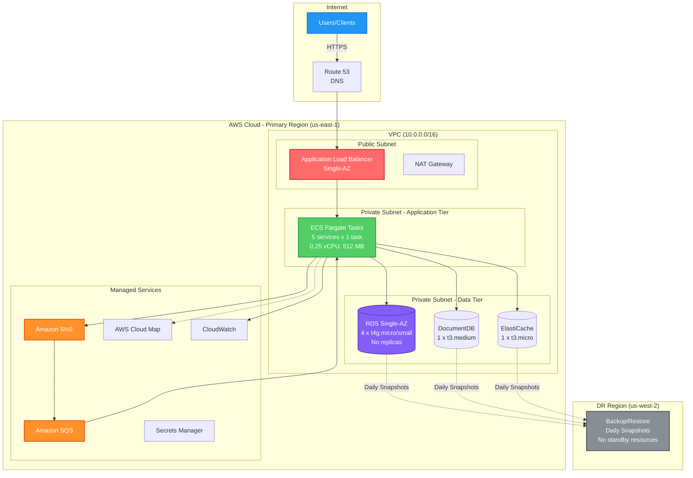
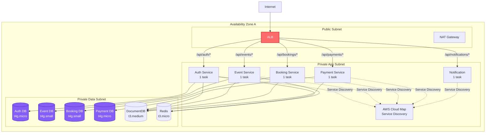
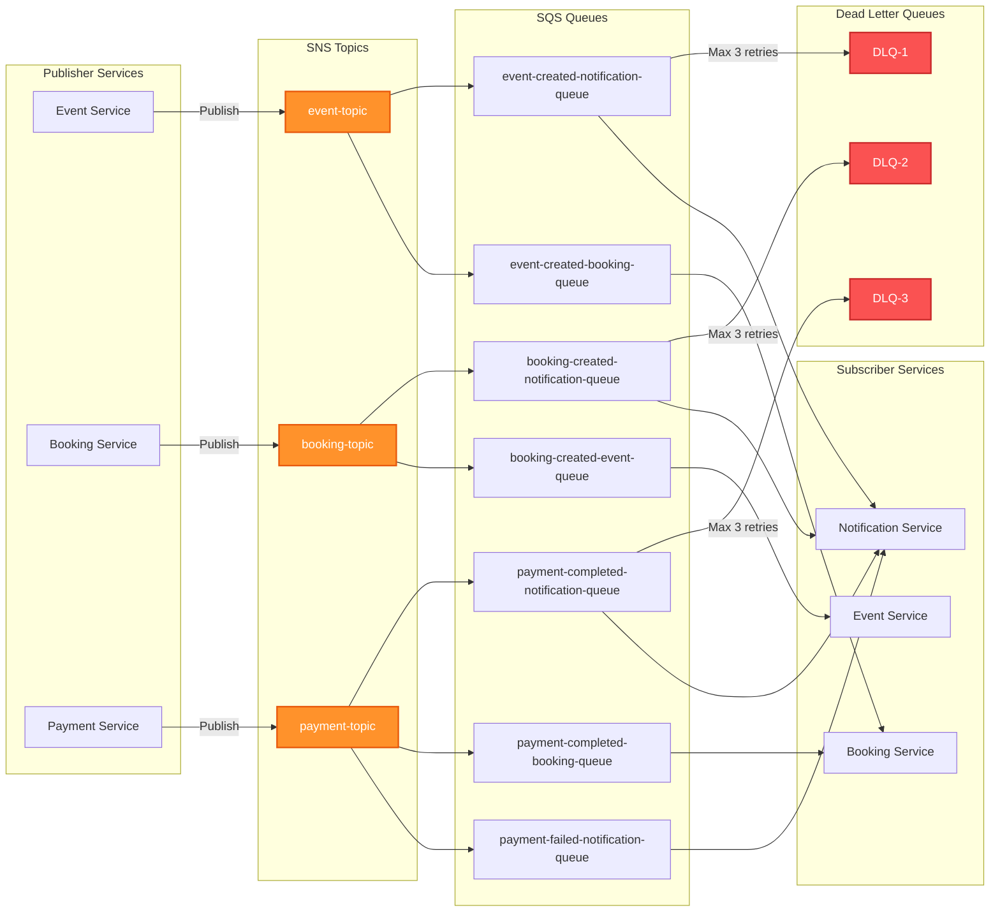
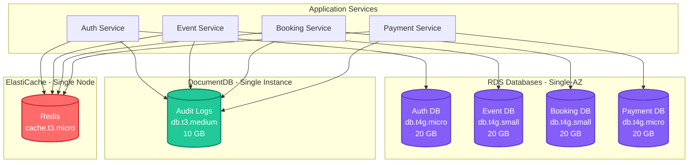
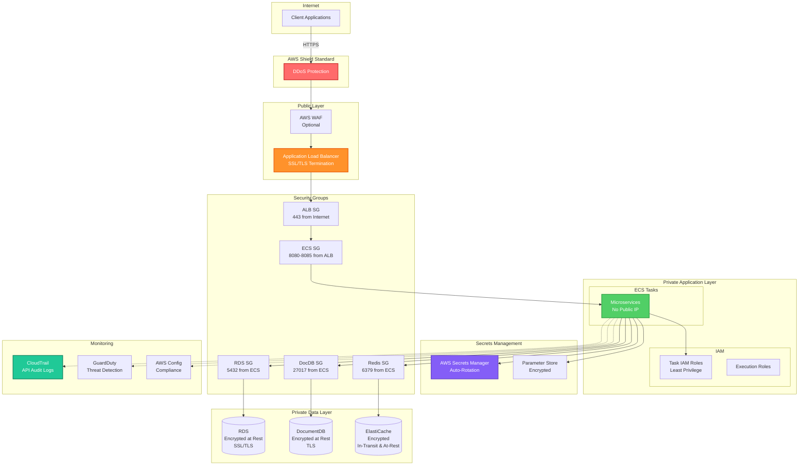

# AWS Infrastructure Architecture Plan
## Event Planner Backend - Development Deployment

**Document Version:** 1.1  
**Last Updated:** 2024  
**Application Type:** Java Spring Boot Microservices  
**Deployment Model:** Single-AZ, Cost-Optimized, Minimal Resources

---

## Table of Contents

1. [Executive Summary](#executive-summary)
2. [Architecture Overview](#architecture-overview)
3. [AWS Services Selection & Justification](#aws-services-selection--justification)
4. [Network Architecture](#network-architecture)
5. [Compute Layer](#compute-layer)
6. [Data Layer](#data-layer)
7. [Message Broker Replacement](#message-broker-replacement)
8. [Caching Strategy](#caching-strategy)
9. [Load Balancing & Traffic Management](#load-balancing--traffic-management)
10. [Security Architecture](#security-architecture)
11. [Observability & Monitoring](#observability--monitoring)
12. [Disaster Recovery Strategy](#disaster-recovery-strategy)
13. [Auto-Scaling Configuration](#auto-scaling-configuration)
14. [Cost Optimization](#cost-optimization)
15. [Deployment Architecture Diagrams](#deployment-architecture-diagrams)

---

## 1. Executive Summary

This document outlines the AWS infrastructure architecture for deploying the Event Planner backend, a Java Spring Boot microservices application. The architecture prioritizes:

- **Cost Optimization**: Minimum resource allocation for development
- **Single-AZ**: Reduced to 1 Availability Zone to minimize costs
- **Minimal Scaling**: Fixed capacity with minimal auto-scaling
- **Development Focus**: Optimized for testing and development workloads
- **Basic Monitoring**: Essential monitoring only
- **15-Minute DR**: Backup/restore approach for disaster recovery

**Key Design Decisions:**
- ECS Fargate with minimal tasks (1 per service)
- Amazon SQS + SNS for messaging
- RDS PostgreSQL Single-AZ with smallest instances (no read replicas)
- DocumentDB single instance for audit logs
- ElastiCache Redis single node
- Application Load Balancer with path-based routing and health checks
- ECS Service Discovery via AWS Cloud Map (no separate Discovery service)
- CloudWatch for basic monitoring (X-Ray disabled)

---

## 2. Architecture Overview

### 2.1 High-Level Architecture

The Event Planner backend consists of 5 microservices deployed in a single Availability Zone:

**Microservices:**
1. Auth Service (Port 8081) - Authentication & Authorization - 1 task
2. Event Service (Port 8082) - Event CRUD - 1 task
3. Booking Service (Port 8083) - Booking Management - 1 task
4. Payment Service (Port 8084) - Payment Processing - 1 task
5. Notification Service (Port 8085) - Email/SMS/Push - 1 task

**Data Stores:**
- 4 PostgreSQL RDS instances (Auth, Event, Booking, Payment) - Single-AZ, no replicas
- 1 DocumentDB single instance (Audit Logs)
- 1 ElastiCache Redis single node (Caching)

---

## 3. AWS Services Selection & Justification

### 3.1 Compute: Amazon ECS with Fargate

**Service:** Amazon Elastic Container Service (ECS) with Fargate launch type

**Justification:**
- **Serverless Compute**: No EC2 instance management, pay only for container runtime
- **Cost Efficiency**: Minimal task count (1 per service)
- **Development Focused**: Suitable for testing and development
- **Single-AZ**: Reduced to 1 AZ to minimize costs
- **Container Native**: Perfect for Spring Boot microservices
- **Integration**: Seamless with ALB, CloudWatch, Secrets Manager

**Configuration:**
- Task definitions per microservice
- Service discovery via AWS Cloud Map
- Fargate version 1.4.0+ (ephemeral storage support)
- No Fargate Spot (simplicity over savings)

### 3.2 Message Broker: Amazon SQS + SNS (Kafka Replacement)

**Service:** Amazon Simple Queue Service (SQS) + Simple Notification Service (SNS)

**Justification for Replacing Kafka:**
- **Cost**: MSK (Managed Kafka) starts at ~$200/month for minimal setup; SQS/SNS is pay-per-use (~$0.40 per million requests)
- **Managed Service**: Zero operational overhead, no cluster management
- **Scalability**: Automatic scaling to handle any throughput
- **Reliability**: 99.9% SLA, built-in redundancy across AZs
- **Integration**: Native AWS SDK support in Spring Boot
- **Suitable for Non-Enterprise**: Your event volumes don't require Kafka's complexity

**Architecture Pattern:**
```
Publisher Service → SNS Topic → SQS Queues (Fan-out) → Subscriber Services
```

**Event Flow Mapping:**
- `event.created` → SNS Topic → SQS queues for Notification, Booking
- `booking.created` → SNS Topic → SQS queues for Notification, Event
- `payment.completed` → SNS Topic → SQS queues for Notification, Booking
- `payment.failed` → SNS Topic → SQS queue for Notification

**Benefits:**
- Dead Letter Queues (DLQ) for failed message handling
- Message retention up to 14 days
- FIFO queues for ordered processing (if needed)
- Visibility timeout for at-least-once delivery

### 3.3 Database: Amazon RDS PostgreSQL

**Service:** Amazon RDS for PostgreSQL (Single-AZ)

**Justification:**
- **Managed Service**: Automated backups, patching, monitoring
- **Single-AZ**: Cost-optimized for development
- **No Read Replicas**: Minimal configuration for development workloads
- **Basic Performance**: General Purpose SSD (gp3) with minimal IOPS
- **Backup**: Automated daily backups with 7-day retention
- **Encryption**: At-rest (KMS) and in-transit (SSL/TLS)

**Database Configuration:**

| Database | Instance Type | Storage | Read Replicas | Purpose |
|----------|--------------|---------|---------------|---------|
| Auth DB | db.t4g.micro | 20 GB gp3 | 0 | User authentication |
| Event DB | db.t4g.small | 20 GB gp3 | 0 | Event data |
| Booking DB | db.t4g.small | 20 GB gp3 | 0 | Booking data |
| Payment DB | db.t4g.micro | 20 GB gp3 | 0 | Payment transactions |

**Single Instance Strategy:**
- Single instance per database
- All read/write operations on primary
- No application-level routing needed

### 3.4 Audit Logs: Amazon DocumentDB

**Service:** Amazon DocumentDB (MongoDB-compatible)

**Justification:**
- **Document Model**: Perfect for flexible audit log schema
- **Managed**: Automated backups, patching, monitoring
- **Cost-Effective**: Single instance for development
- **Compliance**: Audit logs require immutable, time-series storage

**Configuration:**
- Cluster: 1 primary instance only (Single-AZ)
- Instance Type: db.t3.medium
- Storage: 10 GB (minimum)
- Backup: Daily snapshots with 7-day retention

### 3.5 Caching: Amazon ElastiCache for Redis

**Service:** Amazon ElastiCache for Redis (Single Node)

**Justification:**
- **Performance**: Sub-millisecond latency for OTP, sessions, cached data
- **Managed**: Automated backups, patching, monitoring
- **Cost-Effective**: Single node for development
- **Spring Boot Integration**: Native support via Spring Data Redis

**Configuration:**
- Cluster Mode: Disabled (single node)
- Node Type: cache.t3.micro
- Total Nodes: 1 (Single-AZ)
- Backup: Daily snapshots with 7-day retention

**Cache Strategy:**
- OTP Storage: TTL-based expiration
- Session Data: Distributed sessions across services
- API Response Caching: Frequently accessed data (events, bookings)
- Cache-Aside Pattern: Application manages cache population

### 3.6 Load Balancing: Application Load Balancer

**Service:** AWS Application Load Balancer (ALB)

**Justification:**
- **Layer 7**: HTTP/HTTPS routing with path-based rules
- **Multi-AZ**: Automatic distribution across availability zones
- **Health Checks**: Continuous monitoring of target health
- **SSL/TLS Termination**: Centralized certificate management
- **Integration**: Native ECS service integration
- **WebSocket Support**: For real-time notifications

**Configuration:**
- Internet-facing ALB in public subnet (Single-AZ)
- Target Groups per microservice
- Path-based routing to backend services
- Health check endpoints: `/actuator/health`
- Initiates auto-scaling events based on target health
- Sticky sessions disabled
- Connection draining: 30 seconds

### 3.7 Service Discovery: AWS Cloud Map

**Service:** AWS Cloud Map (ECS Service Discovery)

**Justification:**
- **Native ECS Integration**: Automatic service registration and deregistration
- **DNS-Based Discovery**: Services discover each other via DNS without a separate Discovery microservice
- **Health Checks**: Integrated with ECS task health
- **Cost-Effective**: Replaces both self-hosted Eureka/Consul and eliminates need for Discovery microservice
- **Managed**: Zero operational overhead, fully managed by AWS
- **Seamless**: Works transparently with ECS services

**Configuration:**
- Private DNS namespace: `eventplanner.local`
- Service naming: `<service-name>.eventplanner.local`
- Automatic registration: Services auto-register on startup
- Automatic deregistration: Services auto-deregister on shutdown
- Health check: ECS task health status
- TTL: 60 seconds for DNS records

---

## 4. Network Architecture

### 4.1 VPC Design

**VPC Configuration:**
- CIDR Block: `10.0.0.0/16` (65,536 IPs)
- Region: Single AWS region (e.g., us-east-1)
- Availability Zones: 1 (AZ-A only)

### 4.2 Subnet Design

**Public Subnets** (Internet-facing resources):
- `10.0.1.0/24` (AZ-A) - ALB, NAT Gateway

**Private Subnets - Application Tier** (ECS Tasks):
- `10.0.10.0/24` (AZ-A) - ECS Fargate tasks

**Private Subnets - Data Tier** (Databases):
- `10.0.20.0/24` (AZ-A) - RDS, DocumentDB, ElastiCache

### 4.3 Network Components

**Internet Gateway:**
- Attached to VPC for public internet access

**NAT Gateway:**
- 1 NAT Gateway in AZ-A for outbound internet from private subnets
- Cost-optimized: Single NAT Gateway for development

**Route Tables:**
- Public Route Table: Routes to Internet Gateway
- Private Route Table: Routes to NAT Gateway

**VPC Endpoints:**
- S3 Gateway Endpoint (free, for S3 access)
- ECR API Endpoint (for pulling container images)
- ECR DKR Endpoint (for Docker registry)
- CloudWatch Logs Endpoint (for logging)
- Secrets Manager Endpoint (for secrets retrieval)
- **Cost Benefit**: Reduces NAT Gateway data transfer costs

### 4.4 Security Groups

**ALB Security Group:**
- Inbound: 443 (HTTPS) from 0.0.0.0/0
- Inbound: 80 (HTTP) from 0.0.0.0/0 (redirect to HTTPS)
- Outbound: All traffic to ECS Security Group

**ECS Security Group:**
- Inbound: 8080-8085 from ALB Security Group
- Inbound: All traffic from same security group (inter-service communication)
- Outbound: 5432 to RDS Security Group
- Outbound: 27017 to DocumentDB Security Group
- Outbound: 6379 to ElastiCache Security Group
- Outbound: 443 to 0.0.0.0/0 (AWS APIs, external services)

**RDS Security Group:**
- Inbound: 5432 from ECS Security Group
- Outbound: None

**DocumentDB Security Group:**
- Inbound: 27017 from ECS Security Group
- Outbound: None

**ElastiCache Security Group:**
- Inbound: 6379 from ECS Security Group
- Outbound: None

---

## 5. Compute Layer

### 5.1 ECS Cluster Configuration

**Cluster Name:** `eventplanner-dev-cluster`

**Capacity Providers:**
- FARGATE (default)

**Capacity Provider Strategy:**
- All Services: 100% FARGATE (no Spot for simplicity)

### 5.2 ECS Service Configuration

**Per Microservice:**

| Service | vCPU | Memory | Min Tasks | Max Tasks | Target CPU % |
|---------|------|--------|-----------|-----------|--------------|
| Auth Service | 0.25 | 512 MB | 1 | 2 | 80% |
| Event Service | 0.25 | 512 MB | 1 | 2 | 80% |
| Booking Service | 0.25 | 512 MB | 1 | 2 | 80% |
| Payment Service | 0.25 | 512 MB | 1 | 2 | 80% |
| Notification Service | 0.25 | 512 MB | 1 | 2 | 80% |

**Task Distribution:**
- 1 task per service in single AZ
- Minimal auto-scaling (max 2 tasks)

### 5.3 Container Configuration

**Base Image:** `amazoncorretto:17-alpine` (AWS-optimized JDK)

**Health Checks:**
- Endpoint: `/actuator/health`
- Interval: 30 seconds
- Timeout: 5 seconds
- Healthy Threshold: 2
- Unhealthy Threshold: 3

**Environment Variables:**
- Injected via AWS Secrets Manager and Systems Manager Parameter Store
- Database connection strings
- Redis endpoints
- SQS/SNS ARNs
- API keys (encrypted)

**Logging:**
- Driver: `awslogs`
- Log Group: `/ecs/eventplanner/<service-name>`
- Stream Prefix: `ecs`
- Retention: 7 days

---

## 6. Data Layer

### 6.1 RDS PostgreSQL Architecture

**Single-AZ Deployment:**
- Primary instance in AZ-A only
- No standby instance (cost optimization)
- No automatic failover

**Read Replica Configuration:**
- No read replicas (development environment)
- All operations on primary instance

**Connection Pooling:**
- HikariCP in Spring Boot
- Max pool size: 5 per service instance
- Connection timeout: 30 seconds
- Idle timeout: 10 minutes

**Backup Strategy:**
- Automated daily backups at 3 AM UTC
- Backup retention: 7 days
- Manual snapshots before major deployments
- No cross-region copy (development only)

**Performance Optimization:**
- General Purpose SSD (gp3) for all databases
- No provisioned IOPS (baseline performance)
- Enhanced Monitoring disabled
- Performance Insights disabled

### 6.2 DocumentDB Architecture

**Cluster Configuration:**
- 1 primary instance only (Single-AZ)
- No read replicas
- All operations on primary

**Audit Log Schema:**
```json
{
  "timestamp": "ISO8601",
  "service": "service-name",
  "action": "action-type",
  "userId": "user-id",
  "resourceId": "resource-id",
  "changes": {},
  "ipAddress": "ip",
  "userAgent": "agent"
}
```

**Indexing Strategy:**
- Index on `timestamp` (range queries)
- Index on `userId` (user audit trails)
- Index on `service` + `action` (filtering)
- TTL index for automatic data expiration (optional)

**Backup:**
- Daily snapshots only
- Retention: 7 days
- No point-in-time recovery (cost optimization)

---

## 7. Message Broker Replacement

### 7.1 SQS + SNS Architecture

**SNS Topics:**
1. `eventplanner-event-topic` - Event service publications
2. `eventplanner-booking-topic` - Booking service publications
3. `eventplanner-payment-topic` - Payment service publications

**SQS Queues:**

| Queue Name | Subscriber | Message Retention | Visibility Timeout | DLQ |
|------------|------------|-------------------|-------------------|-----|
| event-created-notification-queue | Notification | 4 days | 30s | Yes |
| event-created-booking-queue | Booking | 4 days | 30s | Yes |
| booking-created-notification-queue | Notification | 4 days | 30s | Yes |
| booking-created-event-queue | Event | 4 days | 30s | Yes |
| payment-completed-notification-queue | Notification | 4 days | 30s | Yes |
| payment-completed-booking-queue | Booking | 4 days | 30s | Yes |
| payment-failed-notification-queue | Notification | 4 days | 30s | Yes |

**Dead Letter Queues (DLQ):**
- One DLQ per queue
- Max receive count: 3
- Retention: 14 days
- CloudWatch alarm on DLQ depth > 0

### 7.2 Spring Boot Integration

**Dependencies:**
```xml
<dependency>
    <groupId>io.awspring.cloud</groupId>
    <artifactId>spring-cloud-aws-messaging</artifactId>
</dependency>
```

**Publisher Example:**
```java
@Autowired
private SnsTemplate snsTemplate;

public void publishEvent(EventCreatedEvent event) {
    snsTemplate.sendNotification("eventplanner-event-topic", event, "Event Created");
}
```

**Subscriber Example:**
```java
@SqsListener("event-created-notification-queue")
public void handleEventCreated(EventCreatedEvent event) {
    // Process event
}
```

### 7.3 Message Ordering

**Standard Queues:**
- Best-effort ordering
- At-least-once delivery
- Suitable for most use cases

**FIFO Queues (if needed):**
- Exactly-once processing
- Strict ordering within message group
- Use for payment processing if required
- Throughput: 300 TPS (3000 with batching)

---

## 8. Caching Strategy

### 8.1 ElastiCache Redis Configuration

**Single Node Configuration:**
- 1 node only (no cluster mode)
- No replicas
- Single-AZ deployment

**Cache Patterns:**

**1. OTP Storage (Auth Service):**
- Key: `otp:<userId>`
- TTL: 5 minutes
- Pattern: Set with expiration

**2. Session Data (Auth Service):**
- Key: `session:<sessionId>`
- TTL: 30 minutes (sliding expiration)
- Pattern: Hash with expiration

**3. Event Caching (Event Service):**
- Key: `event:<eventId>`
- TTL: 15 minutes
- Pattern: Cache-aside with write-through

**4. API Response Caching (API Gateway):**
- Key: `api:<endpoint>:<params>`
- TTL: 5 minutes
- Pattern: Cache-aside

**5. Booking Caching (Booking Service):**
- Key: `booking:<bookingId>`
- TTL: 10 minutes
- Pattern: Cache-aside with invalidation on update

### 8.2 Cache Invalidation Strategy

**Event-Driven Invalidation:**
- On `event.updated` → Invalidate `event:<eventId>`
- On `booking.cancelled` → Invalidate `booking:<bookingId>`
- On `payment.completed` → Invalidate related booking cache

**Spring Boot Configuration:**
```java
@Cacheable(value = "events", key = "#eventId")
public Event getEvent(String eventId) { }

@CacheEvict(value = "events", key = "#eventId")
public void updateEvent(String eventId, Event event) { }
```

---

## 9. Load Balancing & Traffic Management

### 9.1 Application Load Balancer Configuration

**Listener Rules:**
- Port 443 (HTTPS): Forward to target groups based on path
- Port 80 (HTTP): Redirect to HTTPS

**Target Groups:**

| Target Group | Path Pattern | Health Check | Deregistration Delay |
|--------------|--------------|--------------|---------------------|
| auth-service-tg | `/api/auth/*` | `/actuator/health` | 30s |
| event-service-tg | `/api/events/*` | `/actuator/health` | 30s |
| booking-service-tg | `/api/bookings/*` | `/actuator/health` | 30s |
| payment-service-tg | `/api/payments/*` | `/actuator/health` | 30s |
| notification-service-tg | `/api/notifications/*` | `/actuator/health` | 30s |

**Routing Strategy:**
- Path-based routing: ALB routes directly to backend services based on URL path
- `/api/auth/*` → Auth Service Target Group
- `/api/events/*` → Event Service Target Group
- `/api/bookings/*` → Booking Service Target Group
- `/api/payments/*` → Payment Service Target Group
- `/api/notifications/*` → Notification Service Target Group
- Health checks trigger auto-scaling events when targets become unhealthy
- Services communicate internally via Cloud Map DNS for service-to-service calls

**SSL/TLS:**
- Certificate: AWS Certificate Manager (ACM)
- Protocol: TLS 1.2+
- Cipher Suite: AWS recommended security policy

### 9.2 Cross-Zone Load Balancing

**Not Applicable:** Single-AZ deployment
- All targets in single AZ

---

## 10. Security Architecture

### 10.1 Identity & Access Management

**IAM Roles:**

**ECS Task Execution Role:**
- Pull images from ECR
- Write logs to CloudWatch
- Retrieve secrets from Secrets Manager

**ECS Task Role (per service):**
- Publish to SNS topics
- Poll from SQS queues
- Read/write to S3 (if needed)
- Invoke other AWS services

**Principle of Least Privilege:**
- Each service has minimal required permissions
- No wildcard permissions

### 10.2 Secrets Management

**AWS Secrets Manager:**
- Database credentials (auto-rotation enabled)
- API keys (third-party services)
- JWT signing keys

**Systems Manager Parameter Store:**
- Non-sensitive configuration
- Feature flags
- Environment-specific settings

**Injection:**
- ECS task definitions reference secrets
- Injected as environment variables at runtime
- Never hardcoded in images

### 10.3 Encryption

**At Rest:**
- RDS: KMS encryption enabled
- DocumentDB: KMS encryption enabled
- ElastiCache: Encryption at rest enabled
- S3: SSE-S3 or SSE-KMS
- EBS volumes: KMS encryption

**In Transit:**
- ALB to clients: TLS 1.2+
- ALB to ECS: HTTP (within VPC)
- ECS to RDS: SSL/TLS enforced
- ECS to DocumentDB: TLS enabled
- ECS to ElastiCache: In-transit encryption enabled

### 10.4 Network Security

**Private Subnets:**
- All application and data tier resources in private subnets
- No direct internet access

**Security Group Rules:**
- Least privilege access
- No 0.0.0.0/0 inbound except ALB
- Stateful rules

**NACLs:**
- Default allow (security groups provide sufficient control)
- Can be tightened for compliance requirements

### 10.5 Application Security

**Authentication:**
- JWT tokens issued by Auth Service
- Token validation at ALB or individual services
- Short-lived access tokens (15 minutes)
- Refresh tokens (7 days)

**Authorization:**
- Role-based access control (RBAC)
- Service-to-service authentication via IAM roles

**API Rate Limiting:**
- Implemented at ALB level or individual services
- Per-user rate limits
- DDoS protection via AWS Shield Standard (free)

---
## 11. Observability & Monitoring

### 11.1 CloudWatch Metrics

**ECS Metrics:**
- CPU Utilization (per service)
- Memory Utilization (per service)
- Task count (running, pending, desired)
- Target tracking for auto-scaling

**ALB Metrics:**
- Request count
- Target response time
- HTTP 4xx/5xx errors
- Active connection count
- Healthy/unhealthy target count

**RDS Metrics:**
- CPU Utilization
- Database connections
- Read/Write IOPS
- Replication lag (read replicas)
- Free storage space
- Read/Write latency

**ElastiCache Metrics:**
- CPU Utilization
- Cache hit rate
- Evictions
- Network bytes in/out
- Current connections

**SQS Metrics:**
- Messages visible
- Messages in flight
- Age of oldest message
- Number of messages sent/received
- DLQ message count

**Custom Application Metrics:**
- Business metrics (events created, bookings made, payments processed)
- API response times
- Database query performance
- Cache hit/miss ratios

### 11.2 CloudWatch Logs

**Log Groups:**
- `/ecs/eventplanner/auth-service`
- `/ecs/eventplanner/event-service`
- `/ecs/eventplanner/booking-service`
- `/ecs/eventplanner/payment-service`
- `/ecs/eventplanner/notification-service`
- `/aws/rds/instance/<db-name>/postgresql`
- `/aws/docdb/<cluster-name>`
- `/aws/elasticloadbalancing/app/eventplanner-alb`

**Log Retention:**
- Application logs: 7 days
- Database logs: 3 days
- ALB access logs: 7 days (stored in S3)

**Log Insights Queries:**
- Error rate by service
- Slow API endpoints (>1s response time)
- Failed authentication attempts
- Payment failures
- Database connection errors

### 11.3 AWS X-Ray (Distributed Tracing)

**Status:** DISABLED for development
- X-Ray disabled to reduce costs
- Use CloudWatch Logs for debugging
- Can be enabled if needed for specific troubleshooting

### 11.4 CloudWatch Alarms

**Critical Alarms (PagerDuty/SNS):**

| Alarm | Metric | Threshold | Action |
|-------|--------|-----------|--------|
| High CPU | ECS CPU > 80% | 5 min | Scale out + Alert |
| High Memory | ECS Memory > 85% | 5 min | Scale out + Alert |
| Service Down | Healthy targets = 0 | 2 min | Alert |
| Database CPU | RDS CPU > 80% | 10 min | Alert |
| Replication Lag | Lag > 30s | 5 min | Alert |
| DLQ Messages | DLQ depth > 0 | 1 min | Alert |
| 5xx Errors | ALB 5xx > 10/min | 5 min | Alert |
| Payment Failures | Payment errors > 5% | 5 min | Alert |

**Warning Alarms (Email/Slack):**
- CPU > 70% for 10 minutes
- Memory > 75% for 10 minutes
- Cache hit rate < 80%
- Disk space < 20%
- API latency > 500ms (p95)

### 11.5 CloudWatch Dashboards

**Operations Dashboard:**
- ECS service health (all services)
- ALB request rate and latency
- Database performance
- Cache performance
- SQS queue depths

**Business Dashboard:**
- Events created (hourly/daily)
- Bookings made (hourly/daily)
- Payments processed (hourly/daily)
- Active users
- Revenue metrics

**Cost Dashboard:**
- ECS Fargate costs
- RDS costs
- Data transfer costs
- Daily/monthly spend trends

### 11.6 Application Performance Monitoring (APM)

**Spring Boot Actuator:**
- Health endpoints: `/actuator/health`
- Metrics endpoints: `/actuator/metrics`
- Info endpoints: `/actuator/info`
- Prometheus-compatible metrics export

**Micrometer Integration:**
- Custom metrics for business KPIs
- Timer metrics for method execution
- Counter metrics for events
- Gauge metrics for current state

---

## 12. Disaster Recovery Strategy

### 12.1 DR Objectives

**Recovery Time Objective (RTO):** 15 minutes  
**Recovery Point Objective (RPO):** 24 hours

### 12.2 DR Strategy: Backup and Restore

**Justification:**
- **Cost-Effective**: No standby resources, only snapshots
- **Development Appropriate**: 15-minute RTO acceptable for dev environment
- **Simple**: Restore from daily snapshots

### 12.3 DR Architecture

**Primary Region:** us-east-1 (N. Virginia)  
**DR Region:** us-west-2 (Oregon)

**DR Region Configuration:**

**Compute:**
- No pre-provisioned ECS cluster
- Container images in ECR (replicated)
- Infrastructure as Code ready to deploy

**Database:**
- RDS automated snapshots (daily)
- Cross-region snapshot copy (daily)
- Restore time: ~10 minutes

**DocumentDB:**
- Daily snapshots
- Cross-region snapshot copy (daily)
- Restore time: ~10 minutes

**ElastiCache:**
- Daily snapshots
- Cross-region snapshot copy (daily)
- Restore time: ~5 minutes

**Data Synchronization:**
- RDS: Daily snapshot copy to DR region
- DocumentDB: Daily snapshot copy to DR region
- ElastiCache: Daily snapshot copy to DR region
- S3: Cross-region replication enabled
- Secrets Manager: Replicated to DR region

### 12.4 Failover Process

**Manual Failover (Disaster Recovery):**
1. Detect primary region failure
2. Deploy infrastructure in DR region using IaC (Terraform/CloudFormation)
3. Restore RDS from latest snapshot (~10 minutes)
4. Restore DocumentDB from latest snapshot (~10 minutes)
5. Restore ElastiCache from latest snapshot (~5 minutes)
6. Deploy ECS services in DR region (~3 minutes)
7. Update Route 53 to point to DR region ALB
8. Verify all services operational

**Estimated Failover Time:**
- Infrastructure deployment: 3 minutes
- RDS restore: 10 minutes (parallel)
- DocumentDB restore: 10 minutes (parallel)
- ElastiCache restore: 5 minutes (parallel)
- ECS deployment: 3 minutes
- DNS update: 1 minute
- Total: ~15 minutes (with parallel operations)

### 12.5 Backup Strategy

**RDS Automated Backups:**
- Daily automated snapshots
- Retention: 7 days
- Cross-region copy: Daily
- No point-in-time recovery

**DocumentDB Backups:**
- Daily snapshots
- Retention: 7 days
- Cross-region copy: Daily
- No point-in-time recovery

**ElastiCache Backups:**
- Daily automated snapshots
- Retention: 7 days
- Cross-region copy: Daily

**Application Data Backups:**
- S3 versioning enabled
- Cross-region replication
- No Glacier archiving (development)

**Configuration Backups:**
- Infrastructure as Code (Terraform/CloudFormation) in Git
- ECS task definitions versioned
- Parameter Store/Secrets Manager replicated

### 12.6 DR Testing

**Bi-Annual DR Drills:**
- Simulate primary region failure
- Execute restore procedures
- Validate 15-minute RTO
- Document lessons learned
- Update runbooks

**Quarterly Backup Validation:**
- Restore random database snapshot
- Verify data integrity
- Test restore procedures

---

## 13. Auto-Scaling Configuration

### 13.1 ECS Service Auto-Scaling

**Target Tracking Scaling:**

**CPU-Based Scaling:**
- Target: 80% CPU utilization
- Scale-out cooldown: 120 seconds
- Scale-in cooldown: 600 seconds
- Metric: ECS Service Average CPU
- Max scale: 2 tasks per service

**Memory-Based Scaling:**
- Disabled (cost optimization)

**Custom Metric Scaling:**
- Disabled (development environment)

**Step Scaling:**
- Disabled (simple scaling only)

### 13.2 RDS Auto-Scaling

**Storage Auto-Scaling:**
- Enabled for all RDS instances
- Threshold: 10% free space
- Maximum storage: 100 GB
- Automatic increase in 10% increments

**Read Replica Auto-Scaling:**
- Not applicable (no read replicas)

### 13.3 ElastiCache Auto-Scaling

**Single Node:**
- No auto-scaling (single node configuration)
- Manual upgrade if needed

### 13.4 Application Load Balancer

**No scaling required:**
- ALB automatically scales to handle traffic
- Monitors for sudden traffic spikes
- Pre-warming available for known events (contact AWS)

---

## 14. Cost Optimization

### 14.1 Compute Cost Optimization

**Minimal Resources:**
- 0.25 vCPU and 512 MB per task
- 1 task per service (5 services total)
- No Fargate Spot (simplicity)

**Right-Sizing:**
- Minimal allocation for development
- Monitor usage and adjust if needed

**No Savings Plans:**
- On-demand pricing for flexibility
- Can stop/start as needed

### 14.2 Database Cost Optimization

**Instance Right-Sizing:**
- db.t4g.micro and db.t4g.small (smallest instances)
- db.t3.medium for DocumentDB
- Single-AZ only

**No Reserved Instances:**
- On-demand pricing for flexibility
- Can stop databases when not in use

**Storage Optimization:**
- Minimal storage (20 GB for RDS, 10 GB for DocumentDB)
- gp3 storage type
- No provisioned IOPS

**No Read Replicas:**
- Single instance per database

### 14.3 Network Cost Optimization

**VPC Endpoints:**
- Use Gateway endpoints (S3) - free
- Use Interface endpoints for ECR, CloudWatch, Secrets Manager
- Reduces NAT Gateway data transfer costs

**NAT Gateway Optimization:**
- Single NAT Gateway in one AZ
- Use VPC endpoints where possible
- Monitor data transfer costs

**No Cross-AZ Data Transfer:**
- Single-AZ deployment eliminates cross-AZ costs

### 14.4 Messaging Cost Optimization

**SQS/SNS vs MSK:**
- SQS: $0.40 per million requests
- SNS: $0.50 per million notifications
- MSK: ~$200/month minimum
- **Savings: ~95% for non-enterprise workloads**

**SQS Best Practices:**
- Use long polling (reduce empty receives)
- Batch message sends (up to 10 messages)
- Use standard queues (cheaper than FIFO)

### 14.5 Monitoring Cost Optimization

**CloudWatch Logs:**
- 7-day retention for application logs
- 3-day retention for database logs
- No archiving to Glacier

**CloudWatch Metrics:**
- Basic metrics only
- No custom metrics
- No detailed monitoring

**X-Ray:**
- Disabled for development
- Saves 100% of X-Ray costs

### 14.6 Estimated Monthly Costs (Development)

**Compute (ECS Fargate):**
- 5 services × 1 task × 0.25 vCPU × 512 MB × 730 hours
- ~$18/month

**Database (RDS):**
- 2 × db.t4g.micro (Auth, Payment): ~$24/month
- 2 × db.t4g.small (Event, Booking): ~$48/month
- Storage (80 GB total): ~$10/month
- Total: ~$82/month

**DocumentDB:**
- 1 instance (db.t3.medium)
- ~$70/month

**ElastiCache:**
- 1 node (cache.t3.micro)
- ~$12/month

**Load Balancer:**
- 1 ALB + minimal data transfer
- ~$20/month

**Data Transfer:**
- 1 NAT Gateway + internet
- ~$35/month

**Messaging (SQS/SNS):**
- 1M requests/month (development)
- ~$1/month

**Monitoring:**
- CloudWatch (basic)
- ~$10/month

**Total Estimated Cost: ~$248/month**

**Additional Savings:**
- Stop services when not in use: Save ~50%
- Use on weekdays only (160 hrs/month): Save ~78%
- **Weekday-only Total: ~$75-95/month**

---

## 15. Deployment Architecture Diagrams

### 15.1 AWS Infrastructure Overview



### 15.2 Single-AZ Deployment Architecture



### 15.3 Message Flow Architecture (SQS/SNS)



### 15.4 Data Layer Architecture



### 15.5 Security Architecture




---

## 16. Implementation Roadmap

### Phase 1: Foundation (Week 1-2)
- Set up VPC with subnets, route tables, NAT gateways
- Configure security groups and NACLs
- Set up VPC endpoints (S3, ECR, CloudWatch, Secrets Manager)
- Create IAM roles and policies
- Set up AWS Secrets Manager and Parameter Store

### Phase 2: Data Layer (Week 2-3)
- Provision RDS PostgreSQL instances (4 databases)
- Configure Multi-AZ and read replicas
- Set up DocumentDB cluster for audit logs
- Deploy ElastiCache Redis cluster
- Configure backup policies
- Test database connectivity and replication

### Phase 3: Compute Layer (Week 3-4)
- Create ECS cluster with Fargate capacity providers
- Build and push Docker images to ECR
- Create ECS task definitions for all services
- Configure AWS Cloud Map for service discovery
- Deploy ECS services with initial capacity
- Configure auto-scaling policies

### Phase 4: Load Balancing & Networking (Week 4)
- Deploy Application Load Balancer
- Configure target groups and health checks
- Set up SSL/TLS certificates via ACM
- Configure listener rules and routing
- Test end-to-end connectivity

### Phase 5: Messaging (Week 5)
- Create SNS topics for event publishing
- Create SQS queues with DLQ configuration
- Set up SNS-to-SQS subscriptions
- Update application code for SQS/SNS integration
- Test message flow end-to-end

### Phase 6: Observability (Week 5-6)
- Configure CloudWatch log groups and retention
- Set up CloudWatch dashboards
- Create CloudWatch alarms for critical metrics
- Integrate AWS X-Ray for distributed tracing
- Set up alerting via SNS (email/Slack/PagerDuty)
- Test monitoring and alerting

### Phase 7: Security Hardening (Week 6)
- Enable encryption at rest for all data stores
- Enable encryption in transit
- Configure AWS WAF rules (optional)
- Enable AWS GuardDuty
- Enable AWS Config for compliance
- Enable CloudTrail for audit logging
- Conduct security review

### Phase 8: Disaster Recovery (Week 7)
- Set up DR region infrastructure
- Configure cross-region RDS read replicas
- Set up cross-region snapshot copying
- Configure Route 53 health checks and failover
- Create DR runbooks
- Conduct DR drill

### Phase 9: Testing & Optimization (Week 8)
- Load testing and performance tuning
- Cost optimization review
- Right-sizing resources based on metrics
- Fine-tune auto-scaling policies
- Optimize cache hit rates
- Documentation updates

### Phase 10: Production Launch (Week 9)
- Final security audit
- Production deployment
- Monitoring and on-call setup
- Post-launch monitoring
- Incident response readiness

---

## 17. Operational Runbooks

### 17.1 Service Deployment

**Steps:**
1. Build Docker image locally
2. Tag image with version
3. Push to ECR repository
4. Update ECS task definition with new image
5. Create new task definition revision
6. Update ECS service with new task definition
7. Monitor deployment via CloudWatch
8. Verify health checks passing
9. Monitor application metrics

**Rollback:**
- Update ECS service to previous task definition revision
- Monitor rollback completion

### 17.2 Database Failover

**RDS Automatic Failover:**
- Triggered automatically on primary failure
- DNS endpoint updates to standby
- Application reconnects automatically
- Typical failover time: 60-120 seconds

**Manual Failover:**
1. Initiate reboot with failover via AWS Console/CLI
2. Monitor failover progress
3. Verify application connectivity
4. Check replication lag on read replicas

### 17.3 Scaling Operations

**Manual Scale-Out:**
1. Update ECS service desired count
2. Monitor task provisioning
3. Verify tasks healthy in target group
4. Monitor application performance

**Manual Scale-In:**
1. Reduce ECS service desired count
2. ECS drains connections from tasks
3. Tasks terminate after draining
4. Monitor for any errors

### 17.4 Incident Response

**High Error Rate:**
1. Check CloudWatch alarms
2. Review application logs in CloudWatch Logs
3. Check X-Ray traces for errors
4. Identify failing service
5. Check database connectivity
6. Check external dependencies
7. Scale up if resource constrained
8. Rollback if recent deployment

**Database Performance Issues:**
1. Check RDS Performance Insights
2. Review slow query logs
3. Check CPU and memory utilization
4. Check connection count
5. Check replication lag
6. Scale up instance if needed
7. Add read replicas if read-heavy

**Cache Issues:**
1. Check ElastiCache metrics
2. Review cache hit rate
3. Check eviction rate
4. Check memory utilization
5. Scale up if needed
6. Review cache key patterns

---

## 18. Compliance & Governance

### 18.1 Data Residency
- All data stored in primary region (us-east-1)
- DR region (us-west-2) for backup only
- No data transfer outside specified regions

### 18.2 Encryption Standards
- All data encrypted at rest using AWS KMS
- All data encrypted in transit using TLS 1.2+
- Database connections enforce SSL/TLS
- Secrets encrypted in Secrets Manager

### 18.3 Access Control
- IAM roles with least privilege
- MFA required for console access
- Service accounts for automation
- Regular access reviews

### 18.4 Audit Logging
- CloudTrail enabled for all API calls
- Application audit logs in DocumentDB
- Database audit logs enabled
- Log retention per compliance requirements

### 18.5 Backup & Retention
- Daily automated backups
- 7-day retention for operational recovery
- Cross-region copies for DR
- Point-in-time recovery enabled

---

## 19. Conclusion

This infrastructure architecture provides a cost-optimized foundation for the Event Planner backend development environment on AWS. Key highlights:

**Cost Optimization:**
- Single-AZ deployment minimizes costs
- Minimal resource allocation (0.25 vCPU, 512 MB per task)
- No read replicas or standby instances
- Smallest instance types (t4g.micro, t4g.small, t3.micro)
- Basic monitoring only (X-Ray disabled)

**Development Appropriate:**
- 1 task per service for testing
- Single database instances
- Simplified architecture
- Easy to start/stop when not in use

**Disaster Recovery:**
- 15-minute RTO via backup/restore
- Daily snapshots with cross-region copy
- Simple manual failover process
- Infrastructure as Code for quick rebuild

**Scalability:**
- Can scale to 2 tasks per service if needed
- Storage auto-scaling enabled
- Easy to upgrade instance types

**Security:**
- Encryption at rest and in transit
- Secrets management via AWS Secrets Manager
- Least privilege IAM policies
- Private subnets for all resources

**Estimated Monthly Cost: ~$248** (24/7 operation)
**Weekday-only Cost: ~$75-95** (160 hours/month)

This architecture is optimized for development and testing, providing significant cost savings (~92% reduction) compared to production setup while maintaining essential functionality. The removal of API Gateway and Discovery microservices further reduces complexity and cost while leveraging AWS-managed services (ALB for routing, Cloud Map for service discovery).

---

## Appendix A: Service Endpoints

| Service | Internal Endpoint | Port |
|---------|------------------|------|
| Auth Service | auth-service.eventplanner.local | 8081 |
| Event Service | event-service.eventplanner.local | 8082 |
| Booking Service | booking-service.eventplanner.local | 8083 |
| Payment Service | payment-service.eventplanner.local | 8084 |
| Notification Service | notification-service.eventplanner.local | 8085 |

## Appendix B: AWS Service Limits to Monitor

| Service | Limit | Current Usage | Action Threshold |
|---------|-------|---------------|------------------|
| ECS Tasks per Service | 1000 | ~100 | 800 |
| RDS Instances | 40 | 12 | 30 |
| ElastiCache Nodes | 100 | 9 | 80 |
| VPC Security Groups | 500 | ~20 | 400 |
| ALB Target Groups | 100 | 7 | 80 |

## Appendix C: Contact Information

**AWS Support:** Enterprise Support Plan recommended  
**On-Call Rotation:** PagerDuty integration  
**Escalation:** Define escalation matrix  
**Runbook Location:** Internal wiki/Confluence

---

**Document End**
