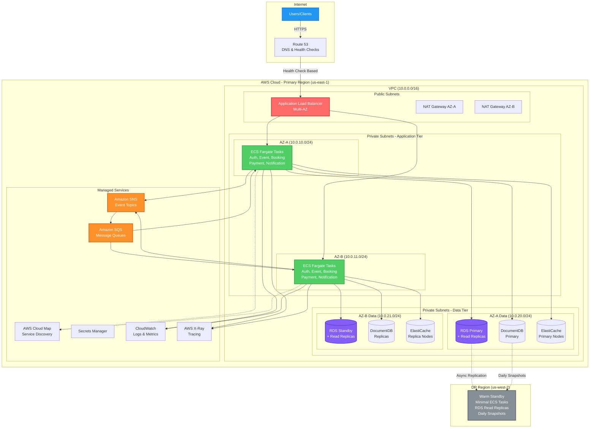
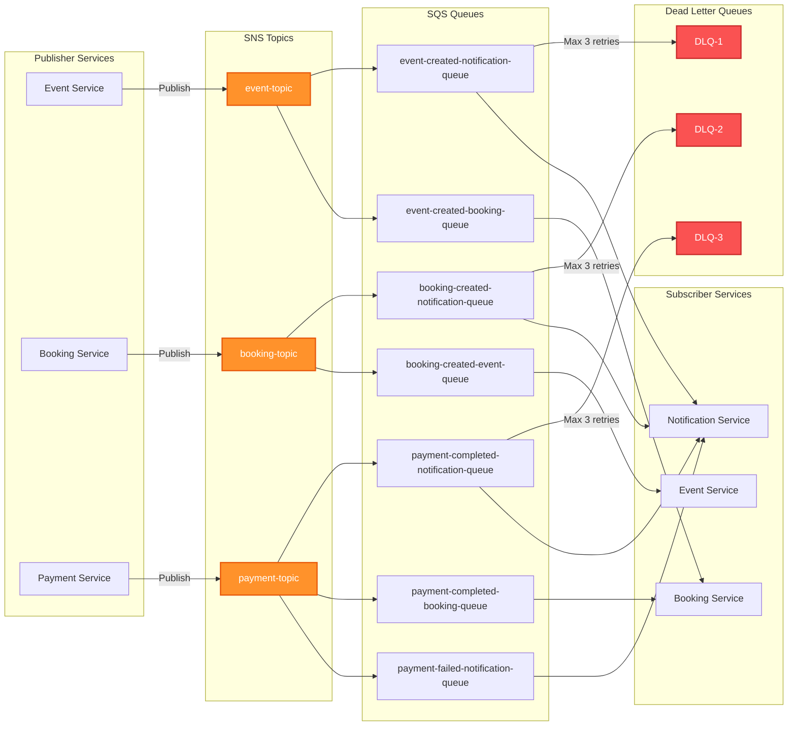
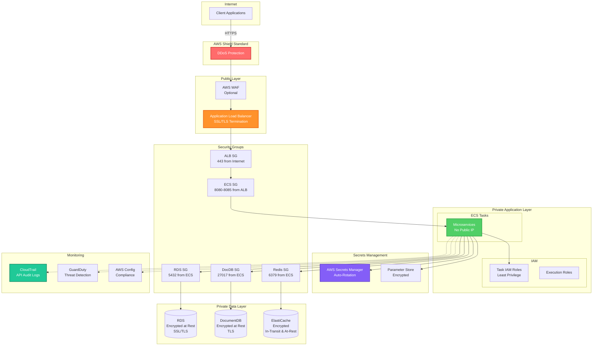
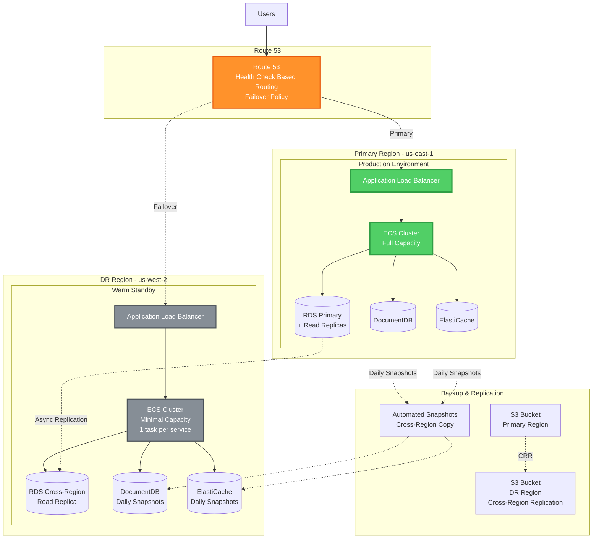

# AWS Infrastructure Architecture Plan
## Event Planner Backend - Production Deployment

**Document Version:** 1.0  
**Last Updated:** 2024  
**Application Type:** Java Spring Boot Microservices  
**Deployment Model:** Multi-AZ, Highly Available, Auto-Scalable

---

## Table of Contents

1. [Executive Summary](#executive-summary)
2. [Architecture Overview](#architecture-overview)
3. [AWS Services Selection & Justification](#aws-services-selection--justification)
4. [Network Architecture](#network-architecture)
5. [Compute Layer](#compute-layer)
6. [Data Layer](#data-layer)
7. [Message Broker Replacement](#message-broker-replacement)
8. [Caching Strategy](#caching-strategy)
9. [Load Balancing & Traffic Management](#load-balancing--traffic-management)
10. [Security Architecture](#security-architecture)
11. [Observability & Monitoring](#observability--monitoring)
12. [Disaster Recovery Strategy](#disaster-recovery-strategy)
13. [Auto-Scaling Configuration](#auto-scaling-configuration)
14. [Cost Optimization](#cost-optimization)
15. [Deployment Architecture Diagrams](#deployment-architecture-diagrams)

---

## 1. Executive Summary

This document outlines the AWS infrastructure architecture for deploying the Event Planner backend, a Java Spring Boot microservices application. The architecture prioritizes:

- **High Availability**: Multi-AZ deployment across 2 Availability Zones
- **Resilience**: Fault-tolerant design with automatic failover
- **Scalability**: Auto-scaling at service and database levels
- **Cost Efficiency**: Budget-conscious service selection without compromising reliability
- **Observability**: Comprehensive monitoring and logging
- **Near-Zero Downtime DR**: Warm standby approach for disaster recovery

**Key Design Decisions:**
- ECS Fargate for containerized microservices (serverless compute)
- Amazon SQS + SNS replacing Kafka (cost-effective, managed messaging)
- RDS PostgreSQL with read replicas for read-intensive workloads
- DocumentDB for audit logs
- ElastiCache Redis for caching layer
- Application Load Balancer with path-based routing and health checks
- ECS Service Discovery via AWS Cloud Map (no separate Discovery service)
- CloudWatch + X-Ray for observability

---

## 2. Architecture Overview

### 2.1 High-Level Architecture

The Event Planner backend consists of 5 microservices deployed across 2 Availability Zones:

**Microservices:**
1. Auth Service (Port 8081) - Authentication & Authorization
2. Event Service (Port 8082) - Event CRUD
3. Booking Service (Port 8083) - Booking Management
4. Payment Service (Port 8084) - Payment Processing
5. Notification Service (Port 8085) - Email/SMS/Push

**Data Stores:**
- 4 PostgreSQL RDS instances (Auth, Event, Booking, Payment)
- 1 DocumentDB cluster (Audit Logs)
- 1 ElastiCache Redis cluster (Caching)

---

## 3. AWS Services Selection & Justification

### 3.1 Compute: Amazon ECS with Fargate

**Service:** Amazon Elastic Container Service (ECS) with Fargate launch type

**Justification:**
- **Serverless Compute**: No EC2 instance management, pay only for container runtime
- **Cost Efficiency**: Fargate Spot for non-critical services (up to 70% savings)
- **Auto-Scaling**: Native integration with Application Auto Scaling
- **Multi-AZ**: Automatic distribution across availability zones
- **Container Native**: Perfect for Spring Boot microservices
- **Integration**: Seamless with ALB, CloudWatch, X-Ray, Secrets Manager

**Configuration:**
- Task definitions per microservice
- Service discovery via AWS Cloud Map
- Fargate version 1.4.0+ (ephemeral storage support)

### 3.2 Message Broker: Amazon SQS + SNS (Kafka Replacement)

**Service:** Amazon Simple Queue Service (SQS) + Simple Notification Service (SNS)

**Justification for Replacing Kafka:**
- **Cost**: MSK (Managed Kafka) starts at ~$200/month for minimal setup; SQS/SNS is pay-per-use (~$0.40 per million requests)
- **Managed Service**: Zero operational overhead, no cluster management
- **Scalability**: Automatic scaling to handle any throughput
- **Reliability**: 99.9% SLA, built-in redundancy across AZs
- **Integration**: Native AWS SDK support in Spring Boot
- **Suitable for Non-Enterprise**: Your event volumes don't require Kafka's complexity

**Architecture Pattern:**
```
Publisher Service → SNS Topic → SQS Queues (Fan-out) → Subscriber Services
```

**Event Flow Mapping:**
- `event.created` → SNS Topic → SQS queues for Notification, Booking
- `booking.created` → SNS Topic → SQS queues for Notification, Event
- `payment.completed` → SNS Topic → SQS queues for Notification, Booking
- `payment.failed` → SNS Topic → SQS queue for Notification

**Benefits:**
- Dead Letter Queues (DLQ) for failed message handling
- Message retention up to 14 days
- FIFO queues for ordered processing (if needed)
- Visibility timeout for at-least-once delivery

### 3.3 Database: Amazon RDS PostgreSQL

**Service:** Amazon RDS for PostgreSQL (Multi-AZ)

**Justification:**
- **Managed Service**: Automated backups, patching, monitoring
- **Multi-AZ**: Synchronous replication for high availability
- **Read Replicas**: 2 read replicas per database for read-intensive workloads
- **Performance**: Provisioned IOPS for consistent performance
- **Backup**: Automated daily backups with 7-day retention
- **Encryption**: At-rest (KMS) and in-transit (SSL/TLS)

**Database Configuration:**

| Database | Instance Type | Storage | Read Replicas | Purpose |
|----------|--------------|---------|---------------|---------|
| Auth DB | db.t4g.medium | 100 GB gp3 | 2 (cross-AZ) | User authentication |
| Event DB | db.t4g.large | 200 GB gp3 | 2 (cross-AZ) | Event data (read-heavy) |
| Booking DB | db.t4g.large | 200 GB gp3 | 2 (cross-AZ) | Booking data (read-heavy) |
| Payment DB | db.t4g.medium | 100 GB gp3 | 2 (cross-AZ) | Payment transactions |

**Read Replica Strategy:**
- Primary: Write operations
- Replica 1 (AZ-A): Read operations for services in AZ-A
- Replica 2 (AZ-B): Read operations for services in AZ-B
- Application-level read/write splitting using Spring Boot datasource routing

### 3.4 Audit Logs: Amazon DocumentDB

**Service:** Amazon DocumentDB (MongoDB-compatible)

**Justification:**
- **Document Model**: Perfect for flexible audit log schema
- **Scalability**: Horizontal scaling with read replicas
- **Performance**: Optimized for write-heavy workloads
- **Managed**: Automated backups, patching, monitoring
- **Cost-Effective**: Cheaper than DynamoDB for large document storage
- **Compliance**: Audit logs require immutable, time-series storage

**Configuration:**
- Cluster: 1 primary + 2 read replicas (across 2 AZs)
- Instance Type: db.t4g.medium
- Storage: Auto-scaling from 10 GB
- Backup: Continuous backup with 7-day retention

### 3.5 Caching: Amazon ElastiCache for Redis

**Service:** Amazon ElastiCache for Redis (Cluster Mode Enabled)

**Justification:**
- **Performance**: Sub-millisecond latency for OTP, sessions, cached data
- **High Availability**: Multi-AZ with automatic failover
- **Scalability**: Cluster mode for horizontal scaling
- **Managed**: Automated backups, patching, monitoring
- **Spring Boot Integration**: Native support via Spring Data Redis

**Configuration:**
- Cluster Mode: Enabled (3 shards, 2 replicas per shard)
- Node Type: cache.t4g.medium
- Total Nodes: 9 (3 primary + 6 replicas across 2 AZs)
- Backup: Daily snapshots with 7-day retention

**Cache Strategy:**
- OTP Storage: TTL-based expiration
- Session Data: Distributed sessions across services
- API Response Caching: Frequently accessed data (events, bookings)
- Cache-Aside Pattern: Application manages cache population

### 3.6 Load Balancing: Application Load Balancer

**Service:** AWS Application Load Balancer (ALB)

**Justification:**
- **Layer 7**: HTTP/HTTPS routing with path-based rules
- **Multi-AZ**: Automatic distribution across availability zones
- **Health Checks**: Continuous monitoring of target health
- **SSL/TLS Termination**: Centralized certificate management
- **Integration**: Native ECS service integration
- **WebSocket Support**: For real-time notifications

**Configuration:**
- Internet-facing ALB in public subnets
- Target Groups per microservice
- Path-based routing to backend services
- Health check endpoints: `/actuator/health`
- Initiates auto-scaling events based on target health
- Sticky sessions for stateful services (if needed)
- Connection draining: 300 seconds

### 3.7 Service Discovery: AWS Cloud Map

**Service:** AWS Cloud Map (ECS Service Discovery)

**Justification:**
- **Native ECS Integration**: Automatic service registration and deregistration
- **DNS-Based Discovery**: Services discover each other via DNS without a separate Discovery microservice
- **Health Checks**: Integrated with ECS task health
- **Cost-Effective**: Replaces both self-hosted Eureka/Consul and eliminates need for Discovery microservice
- **Managed**: Zero operational overhead, fully managed by AWS
- **Seamless**: Works transparently with ECS services

**Configuration:**
- Private DNS namespace: `eventplanner.local`
- Service naming: `<service-name>.eventplanner.local`
- Automatic registration: Services auto-register on startup
- Automatic deregistration: Services auto-deregister on shutdown
- Health check: ECS task health status
- TTL: 60 seconds for DNS records

---

## 4. Network Architecture

### 4.1 VPC Design

**VPC Configuration:**
- CIDR Block: `10.0.0.0/16` (65,536 IPs)
- Region: Single AWS region (e.g., us-east-1)
- Availability Zones: 2 (AZ-A, AZ-B)

### 4.2 Subnet Design

**Public Subnets** (Internet-facing resources):
- `10.0.1.0/24` (AZ-A) - ALB, NAT Gateway
- `10.0.2.0/24` (AZ-B) - ALB, NAT Gateway

**Private Subnets - Application Tier** (ECS Tasks):
- `10.0.10.0/24` (AZ-A) - ECS Fargate tasks
- `10.0.11.0/24` (AZ-B) - ECS Fargate tasks

**Private Subnets - Data Tier** (Databases):
- `10.0.20.0/24` (AZ-A) - RDS, DocumentDB, ElastiCache
- `10.0.21.0/24` (AZ-B) - RDS, DocumentDB, ElastiCache

### 4.3 Network Components

**Internet Gateway:**
- Attached to VPC for public internet access

**NAT Gateways:**
- 2 NAT Gateways (one per AZ) for outbound internet from private subnets
- High availability: Each AZ has its own NAT Gateway

**Route Tables:**
- Public Route Table: Routes to Internet Gateway
- Private Route Tables (per AZ): Routes to respective NAT Gateway

**VPC Endpoints:**
- S3 Gateway Endpoint (free, for S3 access)
- ECR API Endpoint (for pulling container images)
- ECR DKR Endpoint (for Docker registry)
- CloudWatch Logs Endpoint (for logging)
- Secrets Manager Endpoint (for secrets retrieval)
- **Cost Benefit**: Reduces NAT Gateway data transfer costs

### 4.4 Security Groups

**ALB Security Group:**
- Inbound: 443 (HTTPS) from 0.0.0.0/0
- Inbound: 80 (HTTP) from 0.0.0.0/0 (redirect to HTTPS)
- Outbound: All traffic to ECS Security Group

**ECS Security Group:**
- Inbound: 8080-8085 from ALB Security Group
- Inbound: All traffic from same security group (inter-service communication)
- Outbound: 5432 to RDS Security Group
- Outbound: 27017 to DocumentDB Security Group
- Outbound: 6379 to ElastiCache Security Group
- Outbound: 443 to 0.0.0.0/0 (AWS APIs, external services)

**RDS Security Group:**
- Inbound: 5432 from ECS Security Group
- Outbound: None

**DocumentDB Security Group:**
- Inbound: 27017 from ECS Security Group
- Outbound: None

**ElastiCache Security Group:**
- Inbound: 6379 from ECS Security Group
- Outbound: None

---

## 5. Compute Layer

### 5.1 ECS Cluster Configuration

**Cluster Name:** `eventplanner-production-cluster`

**Capacity Providers:**
- FARGATE (default)
- FARGATE_SPOT (for non-critical services)

**Capacity Provider Strategy:**
- All Services: 70% FARGATE, 30% FARGATE_SPOT (cost optimization)

### 5.2 ECS Service Configuration

**Per Microservice:**

| Service | vCPU | Memory | Min Tasks | Max Tasks | Target CPU % |
|---------|------|-----------|-----------|-----------|--------------|
| Auth Service | 0.5 | 1 GB | 4 | 16 | 70% |
| Event Service | 1 | 2 GB | 4 | 20 | 70% |
| Booking Service | 1 | 2 GB | 4 | 20 | 70% |
| Payment Service | 1 | 2 GB | 4 | 16 | 70% |
| Notification Service | 0.5 | 1 GB | 2 | 12 | 70% |

**Task Distribution:**
- Minimum 2 tasks per AZ for each service (high availability)
- Even distribution across AZs using spread placement strategy

### 5.3 Container Configuration

**Base Image:** `amazoncorretto:17-alpine` (AWS-optimized JDK)

**Health Checks:**
- Endpoint: `/actuator/health`
- Interval: 30 seconds
- Timeout: 5 seconds
- Healthy Threshold: 2
- Unhealthy Threshold: 3

**Environment Variables:**
- Injected via AWS Secrets Manager and Systems Manager Parameter Store
- Database connection strings
- Redis endpoints
- SQS/SNS ARNs
- API keys (encrypted)

**Logging:**
- Driver: `awslogs`
- Log Group: `/ecs/eventplanner/<service-name>`
- Stream Prefix: `ecs`
- Retention: 30 days

---

## 6. Data Layer

### 6.1 RDS PostgreSQL Architecture

**Multi-AZ Deployment:**
- Primary instance in AZ-A
- Standby instance in AZ-B (synchronous replication)
- Automatic failover in <60 seconds

**Read Replica Configuration:**
- 2 read replicas per database
- Replica 1: Same AZ as primary (AZ-A)
- Replica 2: Different AZ (AZ-B)
- Asynchronous replication (typically <1 second lag)

**Connection Pooling:**
- HikariCP in Spring Boot
- Max pool size: 20 per service instance
- Connection timeout: 30 seconds
- Idle timeout: 10 minutes

**Read/Write Splitting:**
```java
// Spring Boot configuration
@Primary
@Bean
public DataSource writeDataSource() {
    // Primary RDS endpoint
}

@Bean
public DataSource readDataSource() {
    // Read replica endpoint (round-robin)
}
```

**Backup Strategy:**
- Automated daily backups at 3 AM UTC
- Backup retention: 7 days
- Manual snapshots before major deployments
- Cross-region snapshot copy for DR (weekly)

**Performance Optimization:**
- Provisioned IOPS: 3000 IOPS for Event and Booking DBs
- General Purpose SSD (gp3) for Auth and Payment DBs
- Enhanced Monitoring enabled (1-minute granularity)
- Performance Insights enabled

### 6.2 DocumentDB Architecture

**Cluster Configuration:**
- 1 primary instance (write)
- 2 read replicas (read)
- Distributed across 2 AZs

**Audit Log Schema:**
```json
{
  "timestamp": "ISO8601",
  "service": "service-name",
  "action": "action-type",
  "userId": "user-id",
  "resourceId": "resource-id",
  "changes": {},
  "ipAddress": "ip",
  "userAgent": "agent"
}
```

**Indexing Strategy:**
- Index on `timestamp` (range queries)
- Index on `userId` (user audit trails)
- Index on `service` + `action` (filtering)
- TTL index for automatic data expiration (optional)

**Backup:**
- Continuous backup enabled
- Point-in-time recovery up to 35 days
- Daily snapshots retained for 7 days

---

## 7. Message Broker Replacement

### 7.1 SQS + SNS Architecture

**SNS Topics:**
1. `eventplanner-event-topic` - Event service publications
2. `eventplanner-booking-topic` - Booking service publications
3. `eventplanner-payment-topic` - Payment service publications

**SQS Queues:**

| Queue Name | Subscriber | Message Retention | Visibility Timeout | DLQ |
|------------|------------|-------------------|-------------------|-----|
| event-created-notification-queue | Notification | 4 days | 30s | Yes |
| event-created-booking-queue | Booking | 4 days | 30s | Yes |
| booking-created-notification-queue | Notification | 4 days | 30s | Yes |
| booking-created-event-queue | Event | 4 days | 30s | Yes |
| payment-completed-notification-queue | Notification | 4 days | 30s | Yes |
| payment-completed-booking-queue | Booking | 4 days | 30s | Yes |
| payment-failed-notification-queue | Notification | 4 days | 30s | Yes |

**Dead Letter Queues (DLQ):**
- One DLQ per queue
- Max receive count: 3
- Retention: 14 days
- CloudWatch alarm on DLQ depth > 0

### 7.2 Spring Boot Integration

**Dependencies:**
```xml
<dependency>
    <groupId>io.awspring.cloud</groupId>
    <artifactId>spring-cloud-aws-messaging</artifactId>
</dependency>
```

**Publisher Example:**
```java
@Autowired
private SnsTemplate snsTemplate;

public void publishEvent(EventCreatedEvent event) {
    snsTemplate.sendNotification("eventplanner-event-topic", event, "Event Created");
}
```

**Subscriber Example:**
```java
@SqsListener("event-created-notification-queue")
public void handleEventCreated(EventCreatedEvent event) {
    // Process event
}
```

### 7.3 Message Ordering

**Standard Queues:**
- Best-effort ordering
- At-least-once delivery
- Suitable for most use cases

**FIFO Queues (if needed):**
- Exactly-once processing
- Strict ordering within message group
- Use for payment processing if required
- Throughput: 300 TPS (3000 with batching)

---

## 8. Caching Strategy

### 8.1 ElastiCache Redis Configuration

**Cluster Mode Enabled:**
- 3 shards (node groups)
- 2 replicas per shard
- Total: 9 nodes (3 primary + 6 replicas)
- Distribution: Across 2 AZs

**Cache Patterns:**

**1. OTP Storage (Auth Service):**
- Key: `otp:<userId>`
- TTL: 5 minutes
- Pattern: Set with expiration

**2. Session Data (Auth Service):**
- Key: `session:<sessionId>`
- TTL: 30 minutes (sliding expiration)
- Pattern: Hash with expiration

**3. Event Caching (Event Service):**
- Key: `event:<eventId>`
- TTL: 15 minutes
- Pattern: Cache-aside with write-through

**4. API Response Caching (API Gateway):**
- Key: `api:<endpoint>:<params>`
- TTL: 5 minutes
- Pattern: Cache-aside

**5. Booking Caching (Booking Service):**
- Key: `booking:<bookingId>`
- TTL: 10 minutes
- Pattern: Cache-aside with invalidation on update

### 8.2 Cache Invalidation Strategy

**Event-Driven Invalidation:**
- On `event.updated` → Invalidate `event:<eventId>`
- On `booking.cancelled` → Invalidate `booking:<bookingId>`
- On `payment.completed` → Invalidate related booking cache

**Spring Boot Configuration:**
```java
@Cacheable(value = "events", key = "#eventId")
public Event getEvent(String eventId) { }

@CacheEvict(value = "events", key = "#eventId")
public void updateEvent(String eventId, Event event) { }
```

---

## 9. Load Balancing & Traffic Management

### 9.1 Application Load Balancer Configuration

**Listener Rules:**
- Port 443 (HTTPS): Forward to target groups based on path
- Port 80 (HTTP): Redirect to HTTPS

**Target Groups:**

| Target Group | Path Pattern | Health Check | Deregistration Delay |
|--------------|--------------|--------------|---------------------|
| auth-service-tg | `/api/auth/*` | `/actuator/health` | 30s |
| event-service-tg | `/api/events/*` | `/actuator/health` | 30s |
| booking-service-tg | `/api/bookings/*` | `/actuator/health` | 30s |
| payment-service-tg | `/api/payments/*` | `/actuator/health` | 30s |
| notification-service-tg | `/api/notifications/*` | `/actuator/health` | 30s |

**Routing Strategy:**
- Path-based routing: ALB routes directly to backend services based on URL path
- `/api/auth/*` → Auth Service Target Group
- `/api/events/*` → Event Service Target Group
- `/api/bookings/*` → Booking Service Target Group
- `/api/payments/*` → Payment Service Target Group
- `/api/notifications/*` → Notification Service Target Group
- Health checks trigger auto-scaling events when targets become unhealthy
- Services communicate internally via Cloud Map DNS for service-to-service calls

**SSL/TLS:**
- Certificate: AWS Certificate Manager (ACM)
- Protocol: TLS 1.2+
- Cipher Suite: AWS recommended security policy

### 9.2 Cross-Zone Load Balancing

**Enabled:** Yes (default for ALB)
- Distributes traffic evenly across all targets in all enabled AZs
- Prevents AZ imbalance

---

## 10. Security Architecture

### 10.1 Identity & Access Management

**IAM Roles:**

**ECS Task Execution Role:**
- Pull images from ECR
- Write logs to CloudWatch
- Retrieve secrets from Secrets Manager

**ECS Task Role (per service):**
- Publish to SNS topics
- Poll from SQS queues
- Read/write to S3 (if needed)
- Invoke other AWS services

**Principle of Least Privilege:**
- Each service has minimal required permissions
- No wildcard permissions

### 10.2 Secrets Management

**AWS Secrets Manager:**
- Database credentials (auto-rotation enabled)
- API keys (third-party services)
- JWT signing keys

**Systems Manager Parameter Store:**
- Non-sensitive configuration
- Feature flags
- Environment-specific settings

**Injection:**
- ECS task definitions reference secrets
- Injected as environment variables at runtime
- Never hardcoded in images

### 10.3 Encryption

**At Rest:**
- RDS: KMS encryption enabled
- DocumentDB: KMS encryption enabled
- ElastiCache: Encryption at rest enabled
- S3: SSE-S3 or SSE-KMS
- EBS volumes: KMS encryption

**In Transit:**
- ALB to clients: TLS 1.2+
- ALB to ECS: HTTP (within VPC)
- ECS to RDS: SSL/TLS enforced
- ECS to DocumentDB: TLS enabled
- ECS to ElastiCache: In-transit encryption enabled

### 10.4 Network Security

**Private Subnets:**
- All application and data tier resources in private subnets
- No direct internet access

**Security Group Rules:**
- Least privilege access
- No 0.0.0.0/0 inbound except ALB
- Stateful rules

**NACLs:**
- Default allow (security groups provide sufficient control)
- Can be tightened for compliance requirements

### 10.5 Application Security

**Authentication:**
- JWT tokens issued by Auth Service
- Token validation at ALB or individual services
- Short-lived access tokens (15 minutes)
- Refresh tokens (7 days)

**Authorization:**
- Role-based access control (RBAC)
- Service-to-service authentication via IAM roles

**API Rate Limiting:**
- Implemented at ALB level or individual services
- Per-user rate limits
- DDoS protection via AWS Shield Standard (free)

---
## 11. Observability & Monitoring

### 11.1 CloudWatch Metrics

**ECS Metrics:**
- CPU Utilization (per service)
- Memory Utilization (per service)
- Task count (running, pending, desired)
- Target tracking for auto-scaling

**ALB Metrics:**
- Request count
- Target response time
- HTTP 4xx/5xx errors
- Active connection count
- Healthy/unhealthy target count

**RDS Metrics:**
- CPU Utilization
- Database connections
- Read/Write IOPS
- Replication lag (read replicas)
- Free storage space
- Read/Write latency

**ElastiCache Metrics:**
- CPU Utilization
- Cache hit rate
- Evictions
- Network bytes in/out
- Current connections

**SQS Metrics:**
- Messages visible
- Messages in flight
- Age of oldest message
- Number of messages sent/received
- DLQ message count

**Custom Application Metrics:**
- Business metrics (events created, bookings made, payments processed)
- API response times
- Database query performance
- Cache hit/miss ratios

### 11.2 CloudWatch Logs

**Log Groups:**
- `/ecs/eventplanner/auth-service`
- `/ecs/eventplanner/event-service`
- `/ecs/eventplanner/booking-service`
- `/ecs/eventplanner/payment-service`
- `/ecs/eventplanner/notification-service`
- `/aws/rds/instance/<db-name>/postgresql`
- `/aws/docdb/<cluster-name>`
- `/aws/elasticloadbalancing/app/eventplanner-alb`

**Log Retention:**
- Application logs: 30 days
- Database logs: 7 days
- ALB access logs: 90 days (stored in S3)

**Log Insights Queries:**
- Error rate by service
- Slow API endpoints (>1s response time)
- Failed authentication attempts
- Payment failures
- Database connection errors

### 11.3 AWS X-Ray (Distributed Tracing)

**Integration:**
- X-Ray daemon sidecar in ECS tasks
- Spring Boot X-Ray SDK integration
- Automatic trace propagation across services

**Trace Data:**
- End-to-end request flow
- Service-to-service latency
- Database query performance
- External API calls
- Error and exception tracking

**Service Map:**
- Visual representation of microservices dependencies
- Identify bottlenecks and performance issues
- Track error propagation

### 11.4 CloudWatch Alarms

**Critical Alarms (PagerDuty/SNS):**

| Alarm | Metric | Threshold | Action |
|-------|--------|-----------|--------|
| High CPU | ECS CPU > 80% | 5 min | Scale out + Alert |
| High Memory | ECS Memory > 85% | 5 min | Scale out + Alert |
| Service Down | Healthy targets = 0 | 2 min | Alert |
| Database CPU | RDS CPU > 80% | 10 min | Alert |
| Replication Lag | Lag > 30s | 5 min | Alert |
| DLQ Messages | DLQ depth > 0 | 1 min | Alert |
| 5xx Errors | ALB 5xx > 10/min | 5 min | Alert |
| Payment Failures | Payment errors > 5% | 5 min | Alert |

**Warning Alarms (Email/Slack):**
- CPU > 70% for 10 minutes
- Memory > 75% for 10 minutes
- Cache hit rate < 80%
- Disk space < 20%
- API latency > 500ms (p95)

### 11.5 CloudWatch Dashboards

**Operations Dashboard:**
- ECS service health (all services)
- ALB request rate and latency
- Database performance
- Cache performance
- SQS queue depths

**Business Dashboard:**
- Events created (hourly/daily)
- Bookings made (hourly/daily)
- Payments processed (hourly/daily)
- Active users
- Revenue metrics

**Cost Dashboard:**
- ECS Fargate costs
- RDS costs
- Data transfer costs
- Daily/monthly spend trends

### 11.6 Application Performance Monitoring (APM)

**Spring Boot Actuator:**
- Health endpoints: `/actuator/health`
- Metrics endpoints: `/actuator/metrics`
- Info endpoints: `/actuator/info`
- Prometheus-compatible metrics export

**Micrometer Integration:**
- Custom metrics for business KPIs
- Timer metrics for method execution
- Counter metrics for events
- Gauge metrics for current state

---

## 12. Disaster Recovery Strategy

### 12.1 DR Objectives

**Recovery Time Objective (RTO):** < 15 minutes  
**Recovery Point Objective (RPO):** < 5 minutes

### 12.2 DR Strategy: Warm Standby

**Justification:**
- **Cost-Effective**: Lower cost than active-active multi-region
- **Near-Zero Downtime**: Faster recovery than backup/restore
- **Balanced Approach**: Meets RTO/RPO requirements without excessive cost

### 12.3 DR Architecture

**Primary Region:** us-east-1 (N. Virginia)  
**DR Region:** us-west-2 (Oregon)

**DR Region Configuration:**

**Compute:**
- ECS cluster with minimal capacity (1 task per service)
- Can scale up rapidly when activated
- Same container images in ECR (replicated)

**Database:**
- RDS Cross-Region Read Replicas (asynchronous)
- Replication lag: typically < 5 seconds
- Can be promoted to standalone in DR scenario

**DocumentDB:**
- Cross-region snapshot copy (daily)
- Restore time: ~10 minutes

**ElastiCache:**
- Cross-region backup copy (daily)
- Restore time: ~5 minutes

**Data Synchronization:**
- RDS: Continuous replication via read replicas
- S3: Cross-region replication enabled
- Secrets Manager: Replicated to DR region

### 12.4 Failover Process

**Automated Failover (Route 53 Health Checks):**
1. Route 53 health check detects primary region failure
2. DNS failover to DR region ALB (TTL: 60 seconds)
3. CloudWatch alarm triggers Lambda function
4. Lambda scales up ECS services in DR region
5. Lambda promotes RDS read replica to primary
6. Lambda restores DocumentDB and ElastiCache from snapshots
7. Services become available in DR region

**Manual Failover (Planned Maintenance):**
1. Scale up DR region services
2. Promote RDS read replica
3. Update Route 53 to point to DR region
4. Verify all services operational
5. Scale down primary region

**Estimated Failover Time:**
- DNS propagation: 1-2 minutes
- ECS scale-up: 3-5 minutes
- RDS promotion: 2-3 minutes
- DocumentDB restore: 8-10 minutes
- Total: ~15 minutes

### 12.5 Backup Strategy

**RDS Automated Backups:**
- Daily automated snapshots
- Retention: 7 days
- Cross-region copy: Weekly
- Point-in-time recovery: Up to 35 days

**DocumentDB Backups:**
- Continuous backup enabled
- Retention: 7 days
- Cross-region copy: Daily
- Point-in-time recovery: Up to 35 days

**ElastiCache Backups:**
- Daily automated snapshots
- Retention: 7 days
- Cross-region copy: Weekly

**Application Data Backups:**
- S3 versioning enabled
- Cross-region replication
- Lifecycle policy: Archive to Glacier after 90 days

**Configuration Backups:**
- Infrastructure as Code (Terraform/CloudFormation) in Git
- ECS task definitions versioned
- Parameter Store/Secrets Manager replicated

### 12.6 DR Testing

**Quarterly DR Drills:**
- Simulate primary region failure
- Execute failover procedures
- Validate RTO/RPO metrics
- Document lessons learned
- Update runbooks

**Monthly Backup Validation:**
- Restore random database snapshot
- Verify data integrity
- Test restore procedures

---

## 13. Auto-Scaling Configuration

### 13.1 ECS Service Auto-Scaling

**Target Tracking Scaling:**

**CPU-Based Scaling:**
- Target: 70% CPU utilization
- Scale-out cooldown: 60 seconds
- Scale-in cooldown: 300 seconds
- Metric: ECS Service Average CPU

**Memory-Based Scaling:**
- Target: 75% memory utilization
- Scale-out cooldown: 60 seconds
- Scale-in cooldown: 300 seconds
- Metric: ECS Service Average Memory

**Custom Metric Scaling (Request-Based):**
- Target: 1000 requests per task per minute
- Scale-out cooldown: 60 seconds
- Scale-in cooldown: 300 seconds
- Metric: ALB RequestCountPerTarget

**Step Scaling (for rapid spikes):**
- CPU > 80%: Add 50% capacity
- CPU > 90%: Add 100% capacity
- CPU < 50%: Remove 25% capacity (gradual scale-in)

### 13.2 RDS Auto-Scaling

**Storage Auto-Scaling:**
- Enabled for all RDS instances
- Threshold: 10% free space
- Maximum storage: 1 TB
- Automatic increase in 10% increments

**Read Replica Auto-Scaling:**
- Monitor read replica CPU and connections
- Manual addition of read replicas if sustained high load
- Consider Aurora PostgreSQL for automatic read scaling (future)

### 13.3 ElastiCache Auto-Scaling

**Cluster Mode Enabled:**
- Automatic shard rebalancing
- Can add/remove shards based on load
- Monitor memory usage and evictions

**Scaling Triggers:**
- Memory usage > 75%: Add shard
- CPU > 70%: Add shard
- Evictions > 1000/min: Add shard

### 13.4 Application Load Balancer

**No scaling required:**
- ALB automatically scales to handle traffic
- Monitors for sudden traffic spikes
- Pre-warming available for known events (contact AWS)

---

## 14. Cost Optimization

### 14.1 Compute Cost Optimization

**Fargate Spot:**
- Use for all services (30% Spot, 70% regular)
- Savings: Up to 70% on Spot instances
- Graceful handling of interruptions

**Right-Sizing:**
- Start with conservative resource allocation
- Monitor actual usage via CloudWatch
- Adjust vCPU/memory based on metrics
- Use Compute Optimizer recommendations

**Savings Plans:**
- Commit to 1-year or 3-year Fargate usage
- Savings: Up to 50% vs on-demand
- Flexible across instance types and regions

### 14.2 Database Cost Optimization

**Instance Right-Sizing:**
- Start with t4g instances (Graviton2 - 20% cheaper)
- Monitor CPU/memory usage
- Upgrade only when sustained high utilization

**Reserved Instances:**
- 1-year reserved instances for production databases
- Savings: Up to 40% vs on-demand
- Partial upfront payment for better cash flow

**Storage Optimization:**
- Use gp3 instead of gp2 (20% cheaper)
- Provision IOPS only where needed
- Enable storage auto-scaling to avoid over-provisioning

**Read Replica Optimization:**
- Use smaller instance types for read replicas
- Scale read replicas based on actual read load
- Consider Aurora PostgreSQL for better read scaling economics (future)

### 14.3 Network Cost Optimization

**VPC Endpoints:**
- Use Gateway endpoints (S3) - free
- Use Interface endpoints for high-traffic services
- Reduces NAT Gateway data transfer costs

**NAT Gateway Optimization:**
- Consolidate outbound traffic
- Use VPC endpoints where possible
- Monitor data transfer costs

**Cross-AZ Data Transfer:**
- Minimize cross-AZ traffic where possible
- Use same-AZ read replicas for read operations
- Cost: $0.01/GB for cross-AZ transfer

### 14.4 Messaging Cost Optimization

**SQS/SNS vs MSK:**
- SQS: $0.40 per million requests
- SNS: $0.50 per million notifications
- MSK: ~$200/month minimum
- **Savings: ~95% for non-enterprise workloads**

**SQS Best Practices:**
- Use long polling (reduce empty receives)
- Batch message sends (up to 10 messages)
- Use standard queues (cheaper than FIFO)

### 14.5 Monitoring Cost Optimization

**CloudWatch Logs:**
- Set appropriate retention periods
- Use log filtering to reduce ingestion
- Archive old logs to S3 Glacier

**CloudWatch Metrics:**
- Use metric filters instead of custom metrics where possible
- Aggregate metrics at application level
- Use detailed monitoring only where needed

**X-Ray:**
- Use sampling rules (e.g., 5% of requests)
- Increase sampling for error traces
- Reduces tracing costs by 95%

### 14.6 Estimated Monthly Costs

**Compute (ECS Fargate):**
- 5 services × average 6 tasks × 1 vCPU × 2 GB × 730 hours
- With 30% Spot: ~$685/month

**Database (RDS):**
- 4 databases (t4g.medium/large) + 8 read replicas
- With 1-year RI: ~$1,200/month

**DocumentDB:**
- 1 cluster (3 instances, t4g.medium)
- ~$400/month

**ElastiCache:**
- 9 nodes (cache.t4g.medium)
- With 1-year RI: ~$300/month

**Load Balancer:**
- 1 ALB + data transfer
- ~$50/month

**Data Transfer:**
- NAT Gateway + inter-AZ + internet
- ~$150/month

**Messaging (SQS/SNS):**
- 10M requests/month
- ~$5/month

**Monitoring:**
- CloudWatch + X-Ray
- ~$100/month

**Total Estimated Cost: ~$2,885-3,385/month**

**Cost Optimization Opportunities:**
- Fargate Spot: Save $170/month
- Reserved Instances: Save $400/month
- VPC Endpoints: Save $50/month
- **Optimized Total: ~$2,385-2,885/month**

---

## 15. Deployment Architecture Diagrams

### 15.1 AWS Infrastructure Overview



### 15.2 Multi-AZ Deployment Architecture

```mermaid
graph TB
    subgraph "Availability Zone A"
        subgraph "Public Subnet A"
            ALBA[ALB Node A]
            NATA[NAT Gateway A]
        end
        
        subgraph "Private App Subnet A"
            Auth1[Auth Service<br/>2 tasks]
            Event1[Event Service<br/>2 tasks]
            Booking1[Booking Service<br/>2 tasks]
            Payment1[Payment Service<br/>2 tasks]
            Notif1[Notification<br/>1 task]
            CloudMapSvc1[AWS Cloud Map<br/>Service Discovery]
        end
        
        subgraph "Private Data Subnet A"
            RDSPrimary[(RDS Primary)]
            RDSRead1[(Read Replica 1)]
            DocPrimary[(DocDB Primary)]
            RedisPrimary[(Redis Primary<br/>Shards 1,2,3)]
        end
    end

    subgraph "Availability Zone B"
        subgraph "Public Subnet B"
            ALBB[ALB Node B]
            NATB[NAT Gateway B]
        end
        
        subgraph "Private App Subnet B"
            Auth2[Auth Service<br/>2 tasks]
            Event2[Event Service<br/>2 tasks]
            Booking2[Booking Service<br/>2 tasks]
            Payment2[Payment Service<br/>2 tasks]
            Notif2[Notification<br/>1 task]
            CloudMapSvc2[AWS Cloud Map<br/>Service Discovery]
        end
        
        subgraph "Private Data Subnet B"
            RDSStandby[(RDS Standby)]
            RDSRead2[(Read Replica 2)]
            DocReplica[(DocDB Replica)]
            RedisReplica[(Redis Replicas<br/>Shards 1,2,3)]
        end
    end

    Internet[Internet] --> ALBA
    Internet --> ALBB
    
    ALBA -->|/api/auth/*| Auth1
    ALBA -->|/api/auth/*| Auth2
    ALBA -->|/api/events/*| Event1
    ALBA -->|/api/events/*| Event2
    ALBA -->|/api/bookings/*| Booking1
    ALBA -->|/api/bookings/*| Booking2
    ALBA -->|/api/payments/*| Payment1
    ALBA -->|/api/payments/*| Payment2
    
    ALBB -->|/api/auth/*| Auth1
    ALBB -->|/api/auth/*| Auth2
    ALBB -->|/api/events/*| Event1
    ALBB -->|/api/events/*| Event2
    ALBB -->|/api/bookings/*| Booking1
    ALBB -->|/api/bookings/*| Booking2
    ALBB -->|/api/payments/*| Payment1
    ALBB -->|/api/payments/*| Payment2
    
    Auth1 -.->|Service Discovery| CloudMapSvc1
    Event1 -.->|Service Discovery| CloudMapSvc1
    Booking1 -.->|Service Discovery| CloudMapSvc1
    Payment1 -.->|Service Discovery| CloudMapSvc1
    Notif1 -.->|Service Discovery| CloudMapSvc1
    
    Auth2 -.->|Service Discovery| CloudMapSvc2
    Event2 -.->|Service Discovery| CloudMapSvc2
    Booking2 -.->|Service Discovery| CloudMapSvc2
    Payment2 -.->|Service Discovery| CloudMapSvc2
    Notif2 -.->|Service Discovery| CloudMapSvc2
    
    Auth1 --> RDSPrimary
    Event1 --> RDSRead1
    Booking1 --> RDSRead1
    Payment1 --> RDSPrimary
    
    Auth2 --> RDSPrimary
    Event2 --> RDSRead2
    Booking2 --> RDSRead2
    Payment2 --> RDSPrimary
    
    RDSPrimary -.->|Sync Replication| RDSStandby
    
    Auth1 --> RedisPrimary
    Auth2 --> RedisReplica
    
    Event1 --> DocPrimary
    Event2 --> DocReplica

    style ALBA fill:#FF6B6B,stroke:#C92A2A,stroke-width:2px,color:#fff
    style ALBB fill:#FF6B6B,stroke:#C92A2A,stroke-width:2px,color:#fff
    style RDSPrimary fill:#845EF7,stroke:#5F3DC4,stroke-width:2px,color:#fff
    style RDSStandby fill:#845EF7,stroke:#5F3DC4,stroke-width:2px,color:#fff
```



### 15.3 Message Flow Architecture (SQS/SNS)



### 15.4 Data Layer Architecture

```mermaid
graph TB
    subgraph "Application Services"
        AuthSvc[Auth Service]
        EventSvc[Event Service]
        BookingSvc[Booking Service]
        PaymentSvc[Payment Service]
    end

    subgraph "Auth Database Cluster"
        AuthPrimary[(Auth DB Primary<br/>db.t4g.medium)]
        AuthRead1[(Read Replica 1<br/>AZ-A)]
        AuthRead2[(Read Replica 2<br/>AZ-B)]
    end

    subgraph "Event Database Cluster"
        EventPrimary[(Event DB Primary<br/>db.t4g.large)]
        EventRead1[(Read Replica 1<br/>AZ-A)]
        EventRead2[(Read Replica 2<br/>AZ-B)]
    end

    subgraph "Booking Database Cluster"
        BookingPrimary[(Booking DB Primary<br/>db.t4g.large)]
        BookingRead1[(Read Replica 1<br/>AZ-A)]
        BookingRead2[(Read Replica 2<br/>AZ-B)]
    end

    subgraph "Payment Database Cluster"
        PaymentPrimary[(Payment DB Primary<br/>db.t4g.medium)]
        PaymentRead1[(Read Replica 1<br/>AZ-A)]
        PaymentRead2[(Read Replica 2<br/>AZ-B)]
    end

    subgraph "DocumentDB Cluster"
        DocPrimary[(Audit Logs Primary<br/>db.t4g.medium)]
        DocRead1[(Replica 1<br/>AZ-A)]
        DocRead2[(Replica 2<br/>AZ-B)]
    end

    subgraph "ElastiCache Redis Cluster"
        Shard1[Shard 1<br/>Primary + 2 Replicas]
        Shard2[Shard 2<br/>Primary + 2 Replicas]
        Shard3[Shard 3<br/>Primary + 2 Replicas]
    end

    AuthSvc -->|Write| AuthPrimary
    AuthSvc -->|Read| AuthRead1
    AuthSvc -->|Read| AuthRead2
    
    EventSvc -->|Write| EventPrimary
    EventSvc -->|Read| EventRead1
    EventSvc -->|Read| EventRead2
    
    BookingSvc -->|Write| BookingPrimary
    BookingSvc -->|Read| BookingRead1
    BookingSvc -->|Read| BookingRead2
    
    PaymentSvc -->|Write| PaymentPrimary
    PaymentSvc -->|Read| PaymentRead1
    PaymentSvc -->|Read| PaymentRead2

    AuthSvc --> DocPrimary
    EventSvc --> DocPrimary
    BookingSvc --> DocPrimary
    PaymentSvc --> DocPrimary

    AuthSvc --> Shard1
    EventSvc --> Shard2
    BookingSvc --> Shard3
    PaymentSvc --> Shard1

    AuthPrimary -.->|Async| AuthRead1
    AuthPrimary -.->|Async| AuthRead2
    EventPrimary -.->|Async| EventRead1
    EventPrimary -.->|Async| EventRead2
    BookingPrimary -.->|Async| BookingRead1
    BookingPrimary -.->|Async| BookingRead2
    PaymentPrimary -.->|Async| PaymentRead1
    PaymentPrimary -.->|Async| PaymentRead2
    DocPrimary -.->|Async| DocRead1
    DocPrimary -.->|Async| DocRead2

    style AuthPrimary fill:#845EF7,stroke:#5F3DC4,stroke-width:2px,color:#fff
    style EventPrimary fill:#845EF7,stroke:#5F3DC4,stroke-width:2px,color:#fff
    style BookingPrimary fill:#845EF7,stroke:#5F3DC4,stroke-width:2px,color:#fff
    style PaymentPrimary fill:#845EF7,stroke:#5F3DC4,stroke-width:2px,color:#fff
    style DocPrimary fill:#20C997,stroke:#087F5B,stroke-width:2px,color:#fff
    style Shard1 fill:#FF6B6B,stroke:#C92A2A,stroke-width:2px,color:#fff
    style Shard2 fill:#FF6B6B,stroke:#C92A2A,stroke-width:2px,color:#fff
    style Shard3 fill:#FF6B6B,stroke:#C92A2A,stroke-width:2px,color:#fff
```



### 15.5 Security Architecture



### 15.6 Disaster Recovery Architecture



---

## 16. Implementation Roadmap

### Phase 1: Foundation (Week 1-2)
- Set up VPC with subnets, route tables, NAT gateways
- Configure security groups and NACLs
- Set up VPC endpoints (S3, ECR, CloudWatch, Secrets Manager)
- Create IAM roles and policies
- Set up AWS Secrets Manager and Parameter Store

### Phase 2: Data Layer (Week 2-3)
- Provision RDS PostgreSQL instances (4 databases)
- Configure Multi-AZ and read replicas
- Set up DocumentDB cluster for audit logs
- Deploy ElastiCache Redis cluster
- Configure backup policies
- Test database connectivity and replication

### Phase 3: Compute Layer (Week 3-4)
- Create ECS cluster with Fargate capacity providers
- Build and push Docker images to ECR
- Create ECS task definitions for all services
- Configure AWS Cloud Map for service discovery
- Deploy ECS services with initial capacity
- Configure auto-scaling policies

### Phase 4: Load Balancing & Networking (Week 4)
- Deploy Application Load Balancer
- Configure target groups and health checks
- Set up SSL/TLS certificates via ACM
- Configure listener rules and routing
- Test end-to-end connectivity

### Phase 5: Messaging (Week 5)
- Create SNS topics for event publishing
- Create SQS queues with DLQ configuration
- Set up SNS-to-SQS subscriptions
- Update application code for SQS/SNS integration
- Test message flow end-to-end

### Phase 6: Observability (Week 5-6)
- Configure CloudWatch log groups and retention
- Set up CloudWatch dashboards
- Create CloudWatch alarms for critical metrics
- Integrate AWS X-Ray for distributed tracing
- Set up alerting via SNS (email/Slack/PagerDuty)
- Test monitoring and alerting

### Phase 7: Security Hardening (Week 6)
- Enable encryption at rest for all data stores
- Enable encryption in transit
- Configure AWS WAF rules (optional)
- Enable AWS GuardDuty
- Enable AWS Config for compliance
- Enable CloudTrail for audit logging
- Conduct security review

### Phase 8: Disaster Recovery (Week 7)
- Set up DR region infrastructure
- Configure cross-region RDS read replicas
- Set up cross-region snapshot copying
- Configure Route 53 health checks and failover
- Create DR runbooks
- Conduct DR drill

### Phase 9: Testing & Optimization (Week 8)
- Load testing and performance tuning
- Cost optimization review
- Right-sizing resources based on metrics
- Fine-tune auto-scaling policies
- Optimize cache hit rates
- Documentation updates

### Phase 10: Production Launch (Week 9)
- Final security audit
- Production deployment
- Monitoring and on-call setup
- Post-launch monitoring
- Incident response readiness

---

## 17. Operational Runbooks

### 17.1 Service Deployment

**Steps:**
1. Build Docker image locally
2. Tag image with version
3. Push to ECR repository
4. Update ECS task definition with new image
5. Create new task definition revision
6. Update ECS service with new task definition
7. Monitor deployment via CloudWatch
8. Verify health checks passing
9. Monitor application metrics

**Rollback:**
- Update ECS service to previous task definition revision
- Monitor rollback completion

### 17.2 Database Failover

**RDS Automatic Failover:**
- Triggered automatically on primary failure
- DNS endpoint updates to standby
- Application reconnects automatically
- Typical failover time: 60-120 seconds

**Manual Failover:**
1. Initiate reboot with failover via AWS Console/CLI
2. Monitor failover progress
3. Verify application connectivity
4. Check replication lag on read replicas

### 17.3 Scaling Operations

**Manual Scale-Out:**
1. Update ECS service desired count
2. Monitor task provisioning
3. Verify tasks healthy in target group
4. Monitor application performance

**Manual Scale-In:**
1. Reduce ECS service desired count
2. ECS drains connections from tasks
3. Tasks terminate after draining
4. Monitor for any errors

### 17.4 Incident Response

**High Error Rate:**
1. Check CloudWatch alarms
2. Review application logs in CloudWatch Logs
3. Check X-Ray traces for errors
4. Identify failing service
5. Check database connectivity
6. Check external dependencies
7. Scale up if resource constrained
8. Rollback if recent deployment

**Database Performance Issues:**
1. Check RDS Performance Insights
2. Review slow query logs
3. Check CPU and memory utilization
4. Check connection count
5. Check replication lag
6. Scale up instance if needed
7. Add read replicas if read-heavy

**Cache Issues:**
1. Check ElastiCache metrics
2. Review cache hit rate
3. Check eviction rate
4. Check memory utilization
5. Scale up if needed
6. Review cache key patterns

---

## 18. Compliance & Governance

### 18.1 Data Residency
- All data stored in primary region (us-east-1)
- DR region (us-west-2) for backup only
- No data transfer outside specified regions

### 18.2 Encryption Standards
- All data encrypted at rest using AWS KMS
- All data encrypted in transit using TLS 1.2+
- Database connections enforce SSL/TLS
- Secrets encrypted in Secrets Manager

### 18.3 Access Control
- IAM roles with least privilege
- MFA required for console access
- Service accounts for automation
- Regular access reviews

### 18.4 Audit Logging
- CloudTrail enabled for all API calls
- Application audit logs in DocumentDB
- Database audit logs enabled
- Log retention per compliance requirements

### 18.5 Backup & Retention
- Daily automated backups
- 7-day retention for operational recovery
- Cross-region copies for DR
- Point-in-time recovery enabled

---

## 19. Conclusion

This infrastructure architecture provides a robust, scalable, and cost-effective foundation for the Event Planner backend on AWS. Key highlights:

**Resilience:**
- Multi-AZ deployment ensures high availability
- Automatic failover for databases and compute
- Warm standby DR for near-zero downtime recovery

**Scalability:**
- Auto-scaling at compute and database layers
- Horizontal scaling via ECS Fargate
- Read replicas for read-intensive workloads

**Cost Optimization:**
- SQS/SNS replaces expensive MSK (~95% savings)
- Fargate Spot for 30-70% compute savings
- Reserved instances for predictable workloads
- Right-sized resources based on actual usage

**Observability:**
- Comprehensive CloudWatch monitoring
- Distributed tracing via X-Ray
- Custom business metrics
- Proactive alerting

**Security:**
- Defense in depth with multiple security layers
- Encryption at rest and in transit
- Secrets management via AWS Secrets Manager
- Least privilege IAM policies

**Estimated Monthly Cost: $2,500-3,000** (with optimizations)

This architecture balances cost, performance, and operational excellence, providing a production-ready infrastructure for the Event Planner platform.

---

## Appendix A: Service Endpoints

| Service | Internal Endpoint | Port |
|---------|------------------|------|
| API Gateway | api-gateway.eventplanner.local | 8080 |
| Auth Service | auth-service.eventplanner.local | 8081 |
| Discovery Service | discovery-service.eventplanner.local | 8761 |
| Event Service | event-service.eventplanner.local | 8082 |
| Booking Service | booking-service.eventplanner.local | 8083 |
| Payment Service | payment-service.eventplanner.local | 8084 |
| Notification Service | notification-service.eventplanner.local | 8085 |

## Appendix B: AWS Service Limits to Monitor

| Service | Limit | Current Usage | Action Threshold |
|---------|-------|---------------|------------------|
| ECS Tasks per Service | 1000 | ~100 | 800 |
| RDS Instances | 40 | 12 | 30 |
| ElastiCache Nodes | 100 | 9 | 80 |
| VPC Security Groups | 500 | ~20 | 400 |
| ALB Target Groups | 100 | 7 | 80 |

## Appendix C: Contact Information

**AWS Support:** Enterprise Support Plan recommended  
**On-Call Rotation:** PagerDuty integration  
**Escalation:** Define escalation matrix  
**Runbook Location:** Internal wiki/Confluence

---

**Document End**
