# Design Document

## Overview

The Event Planner Platform DevOps Infrastructure is designed as a cloud-native, multi-tier architecture on AWS that supports separate frontend and backend repositories with automated CI/CD pipelines, comprehensive monitoring, and enterprise-grade security. The design emphasizes scalability, reliability, and cost optimization while providing the foundation for real-time collaboration features and third-party integrations.

The architecture follows AWS Well-Architected Framework principles across five pillars: operational excellence, security, reliability, performance efficiency, and cost optimization.

## Architecture

### High-Level Architecture Diagram

```mermaid
graph TB
    %% Developer Workflow
    subgraph "👨‍💻 Developer Workflow"
        DEV[👨‍💻 Developers]
        GH_FE[📱 Frontend Repo<br/>Angular]
        GH_BE[⚙️ Backend Repo<br/>Java Microservices]
        DEV --> GH_FE
        DEV --> GH_BE
    end
    
    %% CI/CD Pipeline
    subgraph "🔄 GitHub Actions CI/CD"
        GA_FE[🏗️ Frontend Workflow<br/>GitHub Actions]
        GA_BE[🏗️ Backend Workflow<br/>GitHub Actions]
        GA_MS[🔄 Microservice Builds<br/>Maven + Docker]
        ECR[📦 ECR Registry<br/>Container Images]
        S3B[📦 S3 Artifacts<br/>Build Assets]
        
        GH_FE -.->|Push/PR| GA_FE
        GH_BE -.->|Push/PR| GA_BE
        GA_BE --> GA_MS
        GA_FE --> S3B
        GA_MS --> ECR
    end
    
    %% Production Infrastructure
    subgraph "🏗️ Production Infrastructure"
        subgraph "🌐 Public Subnet"
            ALB[⚖️ Application<br/>Load Balancer]
            NAT[🌐 NAT Gateway]
        end
        
        subgraph "🔒 Private Subnet"
            ECS_FE[🐳 ECS Frontend<br/>Fargate Tasks]
            ECS_API[🐳 API Gateway<br/>Service]
            ECS_USER[🐳 User Service<br/>Microservice]
            ECS_EVENT[🐳 Event Service<br/>Microservice]
            ECS_NOTIF[🐳 Notification Service<br/>Microservice]
            PROXY[🔗 RDS Proxy<br/>Connection Pool]
        end
        
        subgraph "🗄️ Database Subnet"
            RDS_MAIN[(🗄️ RDS PostgreSQL<br/>Multi-AZ Primary)]
            RDS_READ[(📖 RDS Read<br/>Replica)]
            REDIS[(⚡ ElastiCache<br/>Redis Cluster)]
        end
        
        CF[🌍 CloudFront CDN<br/>Global Distribution]
        S3W[📁 S3 Static Assets<br/>Website Hosting]
        SQS[📬 SQS Queues<br/>Event Processing]
        
        GA_FE --> CF
        GA_MS --> ECS_API
        GA_MS --> ECS_USER
        GA_MS --> ECS_EVENT
        GA_MS --> ECS_NOTIF
        CF --> S3W
        ALB --> ECS_FE
        ALB --> ECS_API
        ECS_API --> ECS_USER
        ECS_API --> ECS_EVENT
        ECS_API --> ECS_NOTIF
        ECS_USER --> PROXY
        ECS_EVENT --> PROXY
        ECS_NOTIF --> PROXY
        PROXY --> RDS_MAIN
        PROXY --> RDS_READ
        ECS_USER --> REDIS
        ECS_EVENT --> REDIS
        ECS_NOTIF --> SQS
    end
    
    %% Monitoring & Security
    subgraph "📊 Monitoring & Security"
        CW[📊 CloudWatch<br/>Metrics & Logs]
        XR[🔍 X-Ray<br/>Distributed Tracing]
        WAF[🛡️ AWS WAF<br/>Web Protection]
        SM[🔐 Secrets Manager<br/>Credential Storage]
        SHIELD[🛡️ AWS Shield<br/>DDoS Protection]
        
        WAF --> ALB
        SHIELD --> ALB
        CW -.-> ECS_FE
        CW -.-> ECS_API
        CW -.-> ECS_USER
        CW -.-> ECS_EVENT
        CW -.-> ECS_NOTIF
        CW -.-> RDS_MAIN
        XR -.-> ECS_API
        XR -.-> ECS_USER
        XR -.-> ECS_EVENT
        XR -.-> ECS_NOTIF
        SM -.-> ECS_API
        SM -.-> ECS_USER
        SM -.-> ECS_EVENT
        SM -.-> ECS_NOTIF
    end
    
    %% External Integrations
    subgraph "🔌 External Integrations"
        API[🚪 API Gateway<br/>External Webhooks]
        LAMBDA[⚡ Lambda Functions<br/>Serverless Processing]
        SES[📧 SES Email<br/>Notifications]
        STRIPE[💳 Stripe API<br/>Payments]
        CAL[📅 Calendar APIs<br/>Google/Outlook]
        EB[📡 EventBridge<br/>Event Routing]
        
        API --> LAMBDA
        LAMBDA --> SES
        LAMBDA --> STRIPE
        LAMBDA --> CAL
        SQS --> LAMBDA
        LAMBDA --> EB
        EB --> SQS
    end
    
    %% Internet Users
    USERS[🌍 Internet Users] --> CF
    USERS --> ALB
    
    %% Styling
    classDef aws fill:#FF9900,stroke:#232F3E,stroke-width:2px,color:#fff
    classDef compute fill:#FF9900,stroke:#232F3E,stroke-width:2px,color:#fff
    classDef storage fill:#3F48CC,stroke:#232F3E,stroke-width:2px,color:#fff
    classDef network fill:#FF9900,stroke:#232F3E,stroke-width:2px,color:#fff
    classDef security fill:#DD344C,stroke:#232F3E,stroke-width:2px,color:#fff
    
    class ECR,S3B,S3W,RDS_MAIN,RDS_READ,REDIS storage
    class ECS_FE,ECS_BE,CB_FE,CB_BE,LAMBDA compute
    class ALB,CF,NAT,PROXY network
    class WAF,SM,SHIELD security
```



### Network Architecture Diagram

```mermaid
graph TB
    subgraph "🌐 Internet"
        USERS[👥 Users]
        GITHUB[📱 GitHub]
    end
    
    subgraph "🏢 AWS Account: Production"
        subgraph "🌍 Region: us-east-1"
            subgraph "🏗️ VPC: 10.0.0.0/16"
                subgraph "🌐 Public Subnet AZ-A: 10.0.1.0/24"
                    ALB_A[⚖️ ALB]
                    NAT_A[🌐 NAT-A]
                end
                
                subgraph "🌐 Public Subnet AZ-B: 10.0.2.0/24"
                    NAT_B[🌐 NAT-B]
                end
                
                subgraph "🔒 Private Subnet AZ-A: 10.0.11.0/24"
                    ECS_A[🐳 Microservices<br/>API Gateway, User, Event, Notification]
                end
                
                subgraph "🔒 Private Subnet AZ-B: 10.0.12.0/24"
                    ECS_B[🐳 Microservices<br/>API Gateway, User, Event, Notification]
                end
                
                subgraph "🗄️ DB Subnet AZ-A: 10.0.21.0/24"
                    RDS_A[(🗄️ RDS Primary)]
                    REDIS_A[(⚡ Redis)]
                end
                
                subgraph "🗄️ DB Subnet AZ-B: 10.0.22.0/24"
                    RDS_B[(📖 RDS Standby)]
                    REDIS_B[(⚡ Redis)]
                end
                
                IGW[🌐 Internet Gateway]
            end
        end
        
        subgraph "🌍 Global Services"
            CF[🌍 CloudFront]
            S3[📁 S3 Buckets]
            ROUTE53[🌐 Route 53]
        end
    end
    
    %% Connections
    USERS --> CF
    USERS --> ROUTE53
    ROUTE53 --> ALB_A
    CF --> S3
    GITHUB -.->|Push/PR| GA[🏗️ GitHub Actions]
    
    ALB_A --> ECS_A
    ALB_A --> ECS_B
    ECS_A --> RDS_A
    ECS_B --> RDS_A
    ECS_A --> REDIS_A
    ECS_B --> REDIS_B
    
    ECS_A --> NAT_A
    ECS_B --> NAT_B
    NAT_A --> IGW
    NAT_B --> IGW
    
    RDS_A -.->|Sync| RDS_B
    REDIS_A -.->|Cluster| REDIS_B
```



### GitHub Actions CI/CD Flow

```mermaid
sequenceDiagram
    participant Dev as 👨‍💻 Developer
    participant GH as 📱 GitHub
    participant GA as 🏗️ GitHub Actions
    participant ECR as 📦 ECR
    participant ECS as 🐳 ECS
    participant CW as 📊 CloudWatch
    
    Dev->>GH: Push code to branch
    GH->>GA: Trigger workflow
    GA->>GA: Run Maven tests
    GA->>GA: Build microservice containers
    GA->>GA: Security scanning
    GA->>ECR: Push images
    
    alt Staging Deployment
        GA->>ECS: Deploy to staging
        ECS->>CW: Health checks
        CW->>GA: Health status
        GA->>GA: Integration tests
    end
    
    alt Production Deployment (main branch)
        GA->>GA: Wait for approval
        GA->>ECS: Blue-green production deployment
        ECS->>CW: Production health checks
        alt Healthy deployment
            GA->>Dev: Success notification
        else Unhealthy deployment
            GA->>ECS: Automatic rollback
            GA->>Dev: Failure notification
        end
    end
```



### Network Architecture

The infrastructure uses a multi-AZ VPC design with public and private subnets:

- **Public Subnets**: NAT Gateways, Application Load Balancers
- **Private Subnets**: ECS Services, RDS instances, ElastiCache
- **Database Subnets**: Isolated subnets for RDS with no internet access
- **Security Groups**: Least-privilege access controls between tiers

### Multi-Environment Strategy

Each environment (dev, staging, production) is deployed in separate AWS accounts for complete isolation:

- **Development**: Single AZ, smaller instance sizes, shared resources, automated scaling down during idle periods
- **Staging**: Multi-AZ, production-like configuration, blue-green deployments, automated testing validation
- **Production**: Multi-AZ, auto-scaling, high availability, disaster recovery, comprehensive monitoring

**Environment Configuration Management**
- Infrastructure as Code (Terraform) with environment-specific variable files
- Parameterized configurations for environment-specific settings
- Automated configuration drift detection using AWS Config
- Standardized environment provisioning templates
- Consistent security policies across all environments

## Components and Interfaces

### 1. Source Code Management and CI/CD Pipeline

**GitHub Integration**
- Separate repositories for frontend (Angular) and backend (Java microservices)
- Branch protection rules and required status checks
- GitHub Actions workflows for CI/CD automation

**GitHub Actions Workflows**
- Frontend Build: Node.js environment, npm/yarn builds, S3 deployment
- Backend Build: Multi-service Docker containerization with Maven builds
- Microservice-specific workflows for independent deployments
- Shared workflow templates for consistent build processes

**GitHub Actions Pipeline Orchestration**
```yaml
Workflow Stages:
  1. Trigger: Push to main branch or pull request events
  2. Build: Maven compilation and testing for each microservice
  3. Quality: SonarQube analysis and code quality gates
  4. Security: Container vulnerability scanning and dependency checks
  5. Package: Docker image building and ECR push for each service
  6. Deploy-Staging: Automated deployment to staging environment
  7. Integration-Tests: End-to-end testing and service validation
  8. Approval: Manual approval gate for production deployment
  9. Deploy-Production: Blue-green deployment to production
  10. Post-Deploy: Health validation and rollback capability
```

**Pull Request Integration**
- Automated PR validation with GitHub Actions status checks
- Code quality gates and test coverage requirements
- Security vulnerability scanning on PR creation
- Preview environment deployments for feature branches

**Microservices Deployment Strategy**
- Independent deployment pipelines for each microservice
- Service mesh integration for inter-service communication
- Blue-green deployments with ECS service updates
- Automated rollback based on health checks and CloudWatch alarms

### 2. Container Orchestration and Compute

**Amazon ECS with Fargate**
- Serverless container execution for microservices architecture
- Independent scaling for each microservice (API Gateway, User, Event, Notification)
- Service discovery using AWS Cloud Map for inter-service communication
- Task definitions with resource limits and health checks per service
- Service mesh integration for secure microservice communication

**Application Load Balancer**
- Multi-AZ deployment for high availability
- SSL/TLS termination with ACM certificates
- Path-based routing for API versioning
- Health checks and automatic failover

**Microservices Architecture**
- **API Gateway Service**: Request routing, authentication, and rate limiting
- **User Service**: User management, authentication, and profile operations
- **Event Service**: Event creation, management, and scheduling operations
- **Notification Service**: Email, SMS, and push notification handling
- **Shared Libraries**: Common utilities, messaging, and security components

**Auto Scaling Configuration**
```yaml
Scaling Policies (per microservice):
  - Target Tracking: CPU utilization (70%)
  - Target Tracking: Memory utilization (80%)
  - Step Scaling: Request count per target
  - Scheduled Scaling: Predictable traffic patterns
  - Custom Metrics: Service-specific business metrics
```

### 3. Data Layer and Storage

**Amazon RDS PostgreSQL**
- Multi-AZ deployment for high availability
- Read replicas for read-heavy workloads
- Automated backups with point-in-time recovery
- Performance Insights for query optimization
- Connection pooling using RDS Proxy

**Amazon ElastiCache Redis**
- Session storage and application caching
- Cluster mode for horizontal scaling
- Automatic failover and backup
- In-transit and at-rest encryption

**Amazon S3**
- Static website hosting for frontend assets
- Build artifacts and deployment packages
- User-generated content with lifecycle policies
- Cross-region replication for disaster recovery

### 4. Content Delivery and API Management

**Amazon CloudFront**
- Global CDN for static assets and API acceleration
- Custom SSL certificates and security headers
- Origin failover for high availability
- Real-time logs and analytics

**API Gateway**
- RESTful API management and throttling
- Request/response transformation
- API key management and usage plans
- Integration with Lambda for serverless functions

### 5. Message Queuing and Event Processing

**Amazon SQS**
- Decoupled message processing for event notifications
- Dead letter queues for failed message handling
- FIFO queues for ordered processing
- Integration with Lambda for event-driven architecture

**Amazon EventBridge**
- Event routing for third-party integrations
- Custom event patterns and rules
- Cross-account event delivery
- Archive and replay capabilities

### 6. Third-Party Integration Architecture

**Integration Security and Management**
- Secure API key and credential management using AWS Secrets Manager
- Automatic credential rotation for third-party services
- Circuit breaker patterns for external service reliability
- Rate limiting and backoff strategies for API calls

**Integration Patterns**
- Webhook handling through API Gateway and Lambda
- Asynchronous processing using SQS for external service calls
- Retry logic with exponential backoff for failed integrations
- Fallback mechanisms and graceful degradation when services are unavailable

**Supported Integrations**
- Email services (SES) for event notifications
- Calendar APIs (Google Calendar, Outlook) for event synchronization
- Payment gateways (Stripe) for event ticketing and payments
- External event management platforms via standardized APIs

## Data Models

### Infrastructure Configuration Model

```yaml
Environment:
  name: string
  region: string
  availability_zones: [string]
  vpc_cidr: string
  
Compute:
  ecs_cluster: string
  microservices: [MicroserviceDefinition]
  
MicroserviceDefinition:
  name: string
  task_definition: TaskDefinition
  service: ECSService
  scaling_policy: AutoScalingPolicy
  health_check: HealthCheckConfiguration
  
Database:
  engine: postgresql
  version: string
  instance_class: string
  multi_az: boolean
  backup_retention: number
  
Networking:
  load_balancer: ALBConfiguration
  security_groups: [SecurityGroup]
  subnets: [Subnet]
```

### CI/CD Pipeline Model

```yaml
GitHubActionsWorkflow:
  name: string
  repository: GitHubRepository
  triggers: [WorkflowTrigger]
  jobs: [WorkflowJob]
  
WorkflowJob:
  name: string
  runs_on: string
  steps: [WorkflowStep]
  environment: Environment
  
MicroserviceBuild:
  service_name: string
  maven_profile: string
  dockerfile_path: string
  ecr_repository: string
  health_check_endpoint: string
```

### Monitoring and Alerting Model

```yaml
MonitoringConfiguration:
  metrics: [CloudWatchMetric]
  alarms: [CloudWatchAlarm]
  dashboards: [Dashboard]
  log_groups: [LogGroup]
  traces: [XRayTrace]
  
CloudWatchAlarm:
  name: string
  metric: string
  threshold: number
  comparison_operator: string
  notification_targets: [SNSTopic]
  escalation_policy: EscalationPolicy
  
LogConfiguration:
  retention_days: number
  log_level: string
  structured_logging: boolean
  searchable_fields: [string]
  
ObservabilityConfiguration:
  distributed_tracing: boolean
  custom_metrics: [CustomMetric]
  health_checks: [HealthCheck]
  performance_monitoring: boolean
```

## Error Handling

### Pipeline Failure Recovery

**Build Failures**
- Automatic retry with exponential backoff
- Detailed error logging and notification
- Rollback to last known good deployment
- Developer notification via Slack/email integration

**Deployment Failures**
- Automatic rollback using CodeDeploy
- Health check validation before traffic switching
- CloudWatch alarm-based rollback triggers
- Manual intervention capabilities

### Infrastructure Failure Handling

**Service Failures**
- ECS service auto-recovery and replacement
- Multi-AZ failover for RDS and ElastiCache
- Circuit breaker patterns for external dependencies
- Graceful degradation for non-critical features

**Network and Security**
- WAF rules for common attack patterns
- DDoS protection using AWS Shield
- Rate limiting and throttling
- Security incident response automation

### Data Protection and Recovery

**Backup Strategy**
- RDS automated backups with point-in-time recovery (35-day retention)
- S3 versioning and cross-region replication for critical data
- EBS snapshot automation for persistent volumes
- Configuration backup using AWS Config
- Automated backup integrity verification and testing

**Disaster Recovery**
- Cross-region replication for critical data with defined RTO/RPO targets
- Infrastructure as Code for rapid environment reconstruction
- Documented recovery procedures and automated runbooks
- Regular disaster recovery testing and validation
- Automated failover mechanisms for cross-region scenarios
- Recovery point validation and data corruption detection

## Monitoring and Observability Strategy

### Comprehensive Monitoring Framework

**Metrics Collection and Analysis**
- CloudWatch metrics for all AWS services and custom application metrics
- Real-time performance monitoring with configurable thresholds
- Historical trend analysis for capacity planning and optimization
- Custom business metrics for event planning specific KPIs

**Logging and Log Management**
- Centralized logging using CloudWatch Logs with structured log format
- Log aggregation from all application components and infrastructure
- Searchable logs with custom fields and filtering capabilities
- Log retention policies optimized for compliance and cost

**Distributed Tracing and APM**
- AWS X-Ray for distributed tracing across microservices
- End-to-end request tracking for performance optimization
- Error tracking and root cause analysis capabilities
- Service dependency mapping and performance bottleneck identification

**Alerting and Notification Strategy**
- Multi-tier alerting with escalation policies
- Integration with PagerDuty, Slack, and email for incident management
- Automated alert correlation to reduce noise
- Proactive alerting based on predictive analytics and trends

**Health Checks and Status Monitoring**
- Application-level health checks with custom endpoints
- Infrastructure health monitoring with automated recovery
- Service dependency health validation
- Real-time status dashboards for operations teams

## Testing Strategy

### Infrastructure Testing

**Infrastructure as Code Validation**
- Terraform/CloudFormation template validation
- Policy as Code using AWS Config Rules
- Security compliance scanning with AWS Security Hub
- Cost estimation and budget validation

**Pipeline Testing**
- Automated pipeline testing in development environment
- Canary deployments for production validation
- Load testing using AWS Load Testing solution
- Chaos engineering with AWS Fault Injection Simulator

### Security Testing

**Vulnerability Assessment**
- Container image scanning with ECR vulnerability scanning
- Dependency vulnerability scanning in CI/CD pipeline
- Infrastructure security assessment with AWS Inspector
- Penetration testing coordination

**Compliance Validation**
- Automated compliance checking with AWS Config
- Security baseline validation
- Access control testing and validation
- Audit trail verification

### Performance Testing

**Load Testing Strategy**
- Baseline performance testing for each deployment
- Stress testing for peak load scenarios
- Endurance testing for long-running operations
- Scalability testing for auto-scaling validation

**Monitoring and Observability Testing**
- Alert testing and validation
- Dashboard accuracy verification
- Log aggregation and search testing
- Distributed tracing validation

## Security Architecture

### Identity and Access Management

**AWS IAM Strategy**
- Least-privilege access principles
- Role-based access control (RBAC)
- Cross-account role assumptions
- Service-linked roles for AWS services

**Secrets Management**
- AWS Secrets Manager for database credentials
- Parameter Store for configuration values
- Automatic secret rotation
- Encryption in transit and at rest

### Network Security

**VPC Security**
- Private subnets for application and data tiers
- Security groups with minimal required access
- Network ACLs for additional layer of security
- VPC Flow Logs for network monitoring

**Web Application Security**
- AWS WAF for application-layer protection
- SSL/TLS encryption for all communications
- Security headers and CORS configuration
- API rate limiting and throttling

### Data Security

**Encryption Strategy**
- KMS encryption for all data at rest
- TLS 1.2+ for data in transit
- Database encryption with customer-managed keys
- S3 bucket encryption and access logging

**Compliance and Auditing**
- AWS CloudTrail for comprehensive API call logging and audit trails
- AWS Config for configuration compliance and drift detection
- AWS Security Hub for centralized security posture management
- Regular security assessments and automated compliance reporting
- Configuration drift detection with automated alerts and remediation
- Audit trail generation for compliance reporting and security reviews

## Cost Optimization Strategy

### Resource Optimization

**Compute Optimization**
- Fargate Spot for non-critical workloads
- Reserved Instances for predictable workloads
- Auto-scaling policies to match demand
- Right-sizing based on utilization metrics

**Storage Optimization**
- S3 Intelligent Tiering for automatic cost optimization
- EBS GP3 volumes for better price-performance
- Lifecycle policies for log retention
- Data compression and deduplication

### Monitoring and Governance

**Cost Monitoring**
- AWS Cost Explorer for usage analysis and trend identification
- Budget alerts for cost threshold monitoring with finance team notifications
- Resource tagging strategy for detailed cost allocation and chargeback
- Regular cost optimization reviews and recommendations
- Automated cost forecasting and usage analytics
- Idle resource detection and cleanup recommendations

**Resource Governance**
- AWS Organizations for centralized account management
- Service Control Policies for resource restrictions and compliance
- Automated resource cleanup for temporary and unused resources
- Cost allocation tags for departmental chargeback
- AWS Trusted Advisor integration for optimization recommendations
- Automated right-sizing based on utilization metrics